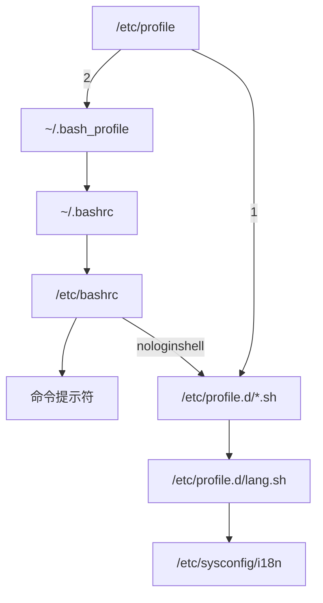

# linux学习笔记


# 一 linux基础知识

## 1.1 linux学习方法

适应命令行操作

### 1.1.1 解决问题的智慧

把问题描述清楚

自己寻找答案

帮助、文档、示例、查找

### 1.1.2 忘掉windows思维方式

计划、专注、坚持、练习

### 1.1.3 学习linux的注意事项

- linux严格区分大小写，命令全是小写
- **tab键可以自动补全文件名**
- linux中所有内容都是以文件形式保存的，包括硬件
    - 硬盘文件是/dev/sd[a-p]
    - 光盘文件是/dev/sr0等
    - 网卡/dev/sysconfig/network-scripts/ifconfig-网卡名
    - **所有功能想要永久生效，都要写入文件**
- linux不靠扩展名区分文件类型，而是通过权限
    - 压缩包：.gz、.bz2、.tar.bz2、.tgz，区分压缩包类型
    - 二进制文件：.rpm
    - 网页文件：.html、.php
    - 脚本文件：.sh
    - 配置文件：.conf
    - 扩展名是为了管理方便
- Windows下的程序不能直接在linux中安装和运行
- linux的所有存储设备都必须挂载之后才能使用，包括U盘、移动硬盘、光盘，需要手动挂载
## 1.2 服务器管理和维护建议

### 1.2.1 linux各目录的作用

| 目录名      | 目录作用                                                     |
| ----------- | ------------------------------------------------------------ |
| /bin        | 存放系统命令的目录，普通用户和root用户都能执行，单用户模式下也能执行 |
| /sbin       | 保存和系统环境设置相关的命令，只有root可以使用，有些可以允许普通用户查看 |
| /usr/bin    | 存放系统命令的目录，普通用户和root用户都能执行，和系统启动无关，单用户模式下不能执行 |
| /usr/sbin   | 存放根文件系统不必要的管理命令，例如服务程序。只用root能使用 |
| --          | --                                                           |
| /boot       | 系统启动目录，保存系统启动相关文件，如内核文件和启动引导程序（grub）文件,单独分区，注意备份 |
| /dev        | 硬件设备文件保存位置。                                       |
| /etc        | 默认配置文件保存位置，需要备份。如账户密码，服务启动脚本，常用服务的配置文件，/etc/profile是shell的全局配置文件 |
| /home       | 普通用户的家目录。是每一个用户的登录位置，但是root的家目录是单独的/root目录，家目录通常用`~`代表 |
| /lib        | 系统调用的函数库保存位置                                     |
| /lost+found | 当系统意外崩溃或机器意外关机，而产生的一些文件碎片存放在这里。系统启动时fsck检查这里并修复损坏的文件系统。每个分区通常都有一个。 |
| --          | --                                                           |
| /media      | 挂载多媒体设备的目录，如：光盘。                             |
| /mnt        | 挂载额外设备，如U盘、移动硬盘、其他分区。                    |
| /misc       | 挂载NFS服务的共享目录                                        |
| --          | --                                                           |
| /opt        | 第三方安装的软件保存位置。但是习惯性把第三方软件安装在/usr/local目录当中 |
| --          | --                                                           |
| /proc       | 存在于内存里，虚拟文件系统。主要保存系统内核，进程，外部设备状态和网络状态灯。如：/proc/cpuinfo是保存CPU信息的，/proc/devices是保存设备驱动列表的，/proc/filesystems保存文件系统列表，/proc/net保存网络协议信息 |
| /sys        | 虚拟文件系统。保存与内核相关信息                             |
| --          | --                                                           |
| /root       | root用户的家目录                                             |
| /srv        | 服务数据目录                                                 |
| /tmp        | 临时文件目录，建议每次开机清空。                             |
| --          | --                                                           |
| /usr        | 系统软件资源目录，usr不是user的缩写，而是`Unix software resource`的缩写。 |
| /var        | 动态数据保存位置。主要保存缓存、日志以及软件运行所产生的文件 |

### 1.2.2 服务器注意事项

- 远程服务器**不允许关机**，只允许重启
- 重启时应该关闭服务
- **不要在服务器访问高峰执行高负载命令**
- 远程配置防火墙时不要把自己踢出服务器（可以在配置防火墙时执行定时任务，5min重置一次防火墙，测试完了，就可以把定时任务关了）
- 指定合理的密码规范并定期更新
- 合理分配权限（越低越好）系统启动的服务越少越好
- 定期备份重要数据和日志
- linux的运维人员需要具备的首要品质：**谨慎、习惯备份**，不要把鸡蛋放在同一个篮子里
- 不要用使用个人机的心态和方法去管理服务器，要用管理服务器的理念去管理服务器

## 1.3 分区知识

分区的目的：把大硬盘分为小的逻辑分区
### 1.3.1 分区类型

- 一块硬盘
    - 主分区最多只能有4个
    - 扩展分区最多只能有1个
    - 主分区和扩展分区加起来不超过4个
    - 扩展分区不能写入数据，不能格式化只能用来包含逻辑分区
    - 逻辑分区可以写入数据和格式化
    - 一个扩展分区内可以有多个逻辑分区
### 1.3.2 格式化

**低级格式化是硬盘的硬件的操作**

高级格式化，又称逻辑格式化，它是根据用户指定的文件系统（Windows：FAT16、FAT32、NTFS；linux：EXT2、EXT3、EXT4）把文件系统写入硬盘内的操作。

格式化的主要目的是在硬盘中写入文件系统，最主要的工作就是按文件系统的规则，把硬盘分成等大小的数据块（block）。构建文件分区表，记录每个文件存在的数据块，也就是每个文件都有的i节点号（i node）。

### 1.3.3 硬件设备文件名

linux分区时需要给每一个分区定义设备文件名

相比于windows，这是linux系统分区特有操作

- windows磁盘分区过程：分区-->格式化-->分配盘符
- linux磁盘分区过程：分区-->设置硬件设备文件名-->格式化-->挂载

`/sda 1 `：第一个SATA硬盘，第一个分区

>逻辑分区不能占用1-4分区号，只能从5开始编号，所以`/sda 5`必定是逻辑分区

### 1.3.4 挂载

给每一个分区分配挂载点

- 必需分区
    - /（根分区）
    - swap分区（交换分区，虚拟内存，内存2倍，不超过2G）
- 推荐分区
    - /boot（启动分区，200M）

linux文件系统结构特点：目录和子目录不一定在一个分区内，子目录可以单独分区，如/home就可以单独分区

## 1.4 安装

### 1. 准备：U盘写入安装映像，设置BIOS

安装映像下载地址：https://www.centos.org/

建议DVD和Minimal ISO都下载，一个用来写入U盘，另一个直接拷贝入U盘。这是因为centos安装过程中要检查.iso文件，需要在U盘里放一个，但是DVD的.iso文件太大，FAT32格式单个文件最大只能4g，所以用Minimal ISO来代替。

U盘写入安装映像需要将安装.iso文件用相应的写入工具写入，常见的工具是UltraISO

BIOS设置U盘启动

### 2. 安装欢迎界面

- Install or upgrade existing system
- Install system with basic video drive 安装基本的显卡驱动
- Rescue installed system
- Boot from local drive
- Memory test 存储介质检测

按e进入设置页面，配置U盘位置防止系统找不到U盘报错：dracut-initqueue timeout和找不到安装源问题

 将配置`vmlinuz initrd=initrd.img inst.stage2=hd......quie`t改为`vmlinuz initrd=initrd.img linux dd quiet`。修改之后回车系统会进入磁盘设备列表，查看U盘的设备名。再将U盘路径修改为`hd:/dev/sdb4(设备文件名) quiet`。


### 密码原则

- 复杂性原则
    - 八位字符以上、大小写字母、数字、符号
    - 不能是英文单词
    - 不能和用户信息相关
- 易记忆性
    - 一句对自己有含义的话
    - `flvx_3QI`(飞流直下三千尺)
- 时效性
    - 三个月--半年更换一次

### 3. 分区

- boot会自动分到sda1
- 根据服务器的用途,例如文件服务器就会给/home单独分区

### 4. 软件包选择

- Desktop 桌面 个人用户
- Minimal Desktop
- Minimal 最小化 服务器，更安全，更稳定
- Basic Server
- Data base Server
- Web Server
- Virtual Host
- software development workstation

### 5. 安装日志

- /root/install.log 存储了安装在系统中的软件包及其版本信息
- /root/install.log.syslog 存储了安装过程中留下的事件信息
- /root/anaconda-ks.cfg 以Kickstart配置文件的格式记录安装过程中设置的选项信息，实现无人批量安装


# 二 远程管理工具

## 2.1 虚拟机的网络配置

1. 桥接：通过windows中的真实网卡直接连接到物理网络，由路由分配ip，就像一台真正的电脑连接入本地网络
2. NAT：通过虚拟网卡VMnet8连接，只能和本地电脑通信，但能访问互联网
3. Host-only：通过虚拟网卡VMnet1连接,只能和本地电脑通信，而且无法访问互联网

>桥接过后无法联网？
>在虚拟机网络编辑器查看网卡连接是否正确。
## 2.2 最小化安装后联网(ip地址配置)

1. 默认状态下最小化安装使用NetworkManager这个服务来控制联网的，但是这个配置在配置生产环境服务器时一般不会使用，而是使用系统自带的network服务，更加稳定，因此先将NetworkManager服务关闭，命令是：
```
systemctl stop NetworkManager
systemctl disable NetworkManager
```
2. 关闭以后，我们来编辑network服务的配置文件，默认路径是：
```
/etc/sysconfig/network-scripts/ifcfg-ensXX
```
在这里XX指的是你的服务器网卡编号。我这里是33，于是命令就是：
```
vi /etc/sysconfig/network-scripts/ifcfg-ens33
```
3. 最小化安装的情况下，默认的获取IP方式BOOTPROTO是dhcp，而且默认不会开机自启动，即ONBOOT="no"，而对于生产环境而言，默认情况下使用固定的IP地址，而且网卡要随系统开机自启动，所以设置：
```
BOOTPROTO=dhcp
ONBOOT=no
改为
BOOTPROTO=static(也可以保持DHCP，通过设置路由来固定ip)
ONBOOT=yes
```
4. 修改完成后，在文件的后面加上下面的内容：（使用DHCP跳过此步）
```
IPADDR=192.168.1.6
PREFIX=24
GATEWAY=192.168.1.1
DNS1=202.103.24.68
```
上面的配置依次是IP地址、掩码、网关和DNS，你可以根据你自己的环境填入合适的内容。
5. 填写完成后保存退出，然后重新启动network服务，命令是：
```
systemctl restart network
```
启动完成没有报错后，执行命令
```
ip addr
```
查看IP地址信息。可以看到已经获取到正确的配置，这个时候用ping命令测试一下，可以看到可以ping通百度的主页，说明网络正常，可以正常联网，到这里网络环境配置完毕。
```
ping -c 5 www.baidu.com
	 -c 5	表示测试五次

不指定次数可是用
[ctrl+c]停止ping
```

## 2.3换国内yum源和epel源（aliyun和网易云）

> 什么是EPEL?
> EPEL的全称叫 Extra Packages for Enterprise Linux 。EPEL是由 Fedora 社区打造，为 RHEL 及衍生发行版如 CentOS、Scientific Linux 等提供高质量软件包的项目。装上了 EPEL之后，就相当于添加了一个第三方源。

1. 备份原文件

    首先进入`/etc/yum.repos.d/`目录下，新建一个`repo_bak`目录，用于保存系统中原来的repo文件:
```
cd /etc/yum.repos.d
mkdir repo_bak
mv *.repo repo_bak/
```
2. 下载repo文件

    要在CentOS中配置使用网易和阿里的开源镜像，需要到网易和阿里开源镜像站点下载系统对应版本的repo文件
```
curl -O http://mirrors.aliyun.com/repo/Centos-7.repo
curl -O http://mirrors.163.com/.help/CentOS7-Base-163.repo
ls
显示下面几个文件：
Centos-7.repo  CentOS-Base-163.repo  repo_bak
```
3. 检查并修改repo文件

    因为国内源基本都升级了https，所以需要修改一下`Centos-7.repo`文件，把里面的所有`http:`改为`https:`

4. 清除系统yum缓存并生成新的yum缓存
```
yum clean all
yum makecache
```
4. 安装epel源
```
yum list | grep epel-release
yum install -y epel-release
```
5. 使用阿里开源镜像提供的epel源
```
curl -O http://mirrors.aliyun.com/repo/epel-7.repo
或者
wget -O /etc/yum.repos.d/epel-7.repo http://mirrors.aliyun.com/repo/epel-7.repo
```
>安装wget：yum install wget
6. 再次清除系统yum缓存，并重新生成新的yum缓存
```
yum clean all
yum makecache
```
7. 查看系统可用的yum源和所有的yum源
```
查看正在使用的源
yum repolist enabled
查看所有源
yum repolist all
```

## 2.4 安装ifconfig

>ifconfig命令可以用于查看、配置、启用或禁用指定网络接口，如配置网卡的IP地址、掩码、广播地址、网关等，功能不可谓不丰富。但是，CentOS 7默认已不再安装此命令，其中很多功能用ip addr指令替代了。

>考虑到 既有的很多管理工具或脚本都调用了此功能命令（ifconfig），如果将这些工具直接迁移过来会报错，如果对这个指令用其它指令进行替换，及对这些工具升级，则增加了工作量，还增加了出错的风险。
>所以，在CentOS 7 系统中 安装 ifconfig 命令很有必要。
1. 查找含有ifconfig的包
```
yum search ifconfig
```
2.  找到需要安装net-tools.x86_64

```
yum install net-tools.x86_64
以下命令输出正常即安装成功：
ifconfig
```
## 2.5 yum常用命令

```
列出所有可更新的软件清单
yum check-update

安装所有更新软件（远程服务器慎用）
yum update

仅安装指定的软件
yum install <package_name>

仅更新指定的软件
yum update <package_name>

用YUM安装软件包
yum install <package_name>

用YUM删除软件包
yum remove <package_name>
```
## 2.6 SecureCRT远程连接和winSCP文件传输

df查看磁盘空间
乱码调整：选项-->会话选项：更改外观字体，编码格式


#  三 linux常用命令

## 3.1 文件处理命令

### 3.1.1 命令格式与目录处理命令ls

- **命令格式**：`命令 [-选项] [参数]`
    - 例：`ls -la /etc`
- **说明**：
    - 个别命令使用不遵循此格式
    - 当有多个选项时，可以写在一起`-l -a=-la`
    - 简化选项与完整选项：`-a等于--all`
- 显示目录文件`ls`
```
命令原意：list
路径：/bin/ls
权限：所有用户
功能描述：显示目录文件
    ls -a（--all）显示所有，查看隐藏文件
    隐藏文件的意义：这是一个系统文件，用户除非知道自己在干啥，
    否则不需要查看和修改这些文件

    ls -l(--long)h（human人性化显示）显示文件详细信息
    ll 是ls -l的简化版，方便输入

    ls -ld查看目录本身的详细信息
    
    ls -i（inode）查看文件的id
```
文件详细信息显示格式：
| 权限       | 引用系数 | 所有者u（user） | 所属组g（group） | 大小 | 修改时间     | 文件名   |
| ---------- | -------- | --------------- | ---------------- | ---- | ------------ | -------- |
| drwxr-xr-x | 3        | root            | root             | 4.0K | Jul 23 18:39 | download |

|文件权限||||
|--|--|--|--|
|文件类型|rw-|r--|r--|
|`-`二进制文件，`d`目录，`l`软链接文件|u所有者|g所属组|o其他|
|-|r读|w写|x执行|

### 3.1.2 目录处理命令

#### 创建目录mkdir

```
原意：make dirctories
路径：/bin/mkdir
权限：所有用户
    mkdir -p [目录名]
    创建新目录
    -p递归创建
例：mkdir -p /tmp/myvideo/mv
即使myvideo和mv都是不存在的目录，也会连续创建
```

#### 打开目录cd

```
原意：change directory
路径：shell内置
权限：所有用户
    cd [目录]
    切换目录
    cd ..回到上级目录
```
`.`表示当前目录`..`表示当前目录的上一级目录

#### 显示当前路径pwd

```
原意：print working directory
路径：/bin/pwd
权限：所有用户
    pwd
    显示当前目录
```

#### 删除空目录rmdir

```
原意：remove empty directories
路径：/bin/rmdir
权限：所有用户
    rmdir [目录名]
    删除空目录
```

#### 复制cp

```
原意：copy
路径：/bin/cp
权限：所有用户
    cp -rp [原文件或目录] [目标目录]
       -r复制目录
       -p保留文件属性(修改时间不变)
    复制文件或目录
    可以同时改名，目标目录指定新名称即可
```

#### 移动(剪切)，改名mv

```
原意：move
路径：/bin/mv
权限：所有用户
    mv -r [原文件或目录] [目标目录]
       -r 目录
    剪切文件
    
    mv [原名] [新名]
    修改文件名
```

#### 删除rm

```
原意：remove
路径：/bin/rm
权限：所有用户
    rm -rf [文件或目录]
       -r	删除目录
       -f	（force）强制执行
    删除文件
```

### 3.1.3 文件处理命令

#### 创建空文件touch

```
路径：/bin/touch
权限：所有用户
    touch [文件名]
    创建空文件
文件命名注意：
1. 后缀名对系统没有意义
2. 可以包含特殊符号，如空格，但不推荐，操作麻烦
```

#### 显示文件内容cat

```
路径：/bin/cat
权限：所有用户
    cat -n [文件名]
        -n	显示行号
    显示文件内容
    
    tac
    反向显示文件内容（最后一行变到第一行）
```

#### 分页显示文件内容more

```
路径：/bin/more
权限：所有用户
    more [文件名]
        空格或f 翻页
        (enter) 换行
        q或Q    退出
分页显示文件内容
```

#### 可向上翻页less

```
路径：/usr/bin/less
权限：所有用户
    less [文件名]
分页显示文件内容，可向上翻页，可搜索查找
    /(搜索内容)
    n查找下一个
```

#### 查看文件前几行head

```
head -n [行号] [文件名]
     -n n是数字，显示文件的前n行（看注释）
    默认10行
```

#### 查看文件后几行tail

```
tail -n指定行数
     -f动态显示（监控日志）
```

### 3.1.4 链接命令ln

```
原意：link
路径：/bin/ln
权限：所有用户
ln -s [原文件] [目标文件]
   -s	创建软链接

功能：生成链接文件

ln -s /etc/issue /tmp/issue.soft
创建/etc/issue的软链接/tmp/issue.soft

ln /etc/issue /tmp/issue.hard
创建/etc/issue的硬链接/tmp/issue.hard
```
软链接和硬链接的区别：
- 软链接
    - 文件类型`l`，所有用户满权限，类似于快捷方式，但文件权限最终决定于指向的文件
    - 文件大小很小，只是符号链接
    - 箭头指向源文件`/tmp/issue.soft -> /etc/issue`
- 硬链接（用得少，备份）
    - 相当于`cp -p +同步更新`，即使删除原文件，硬链接文件依然能够访问
    - 可以通过i节点识别，硬链接文件i节点相同`ls -i`
    - 不能跨分区
    - 不能针对目录使用

### 3.1.5 统计文件行数wc -l

```
Usage: wc [OPTION]... [FILE]...

Print newline, word, and byte counts for each FILE, and a total line if
more than one FILE is specified.  With no FILE, or when FILE is -,
read standard input.  A word is a non-zero-length sequence of characters
delimited by white space.

  -c, --bytes            统计文件字节数
  -m, --chars            统计文件字母数
  -l, --lines            统计文件行数
      --files0-from=F    read input from the files specified by
                           NUL-terminated names in file F;
                           If F is - then read names from standard input
  -L, --max-line-length  输出最长行长度
  -w, --words            输出文件单词数
      --help     display this help and exit
      --version  output version information and exit

```


## 3.2 权限管理命令

### 3.2.1 更改文件权限chmod

- 原意：change the permissions mode of a file
- 路径：/bin/chmod
- 权限：文件所有者，root
```
chmod -R [{ugoa}{+-=}{rwx}] [文件或目录]
      [mode=421] [文件或目录]
      r-4
      w-2
      x-1
      -R 递归修改
    修改目录及其目录下的文件为相应权限
```
| 代表字符 | 权限     | 对文件的含义                  | 对目录的含义                           |
| -------- | -------- | ----------------------------- | -------------------------------------- |
| r        | 读权限   | 可以查看文件内容cat/more/less | 可以列出目录中的内容ls                 |
| w        | 写权限   | 可修改文件内容vim             | 可以在目录中创建删除文件touch/mkdir/rm |
| x        | 执行权限 | 可以执行文件                  | 可以进入目录cd                         |
```
拓展：
useradd 添加用户
password 用户名 设置密码
```
个人普通文件常用权限分配：目录755文件775

### 3.2.2 其他权限管理命令

#### 更改所有者chown

```
原意：change file ownership
路径：/bin/chown
权限：root
    chown [用户] [文件/目录]
    改变文件或目录的所有者
```

#### 更改所属组chgrp

```
原意：change file group ownership
路径：/bin/chgrp
权限：root
    chgrp [用户组] [文件或目录]
    更改文件或目录的所属组
    
    拓展：
    groupadd 组名 添加用户组
```

#### 设置默认权限umask

```
原意：the user file-creation mask
路径：shell内置命令
权限：root
    umask -S
    显示当前新建文件的缺省权限，用rwx表示
    缺省创建的文件不能有x权限，所以新建的文本文件没有x，但目录文件可以有（安全考虑）
    
    umask 查询当前缺省权限值
    如果返回为：
    0022
    0特殊权限
     022 --- -w- -w- 三个用户类型的权限值
     777 rwx rwx rwx 逻辑相与非
     ---------------------
     755 rwx r-x r-x
     755 = 777 - 022
    
    umask 077 设置缺省权限为700
```


## 3.3 文件搜索命令

搜索是资源消耗很大的命令，在服务器运维中使用要避开服务器使用高峰期，尽量不用搜索命令，目录规划清晰，找文件就好找了。

搜索命令使用原则：

- 能不用则不用
- 一旦使用选择的范围尽量小
- 搜索条件尽量精准

### 3.3.1 文件搜索命令find

```
路径：/bin/find
权限：所有用户
    find [搜索范围] [匹配条件]
    文件搜索
    find /root/ -name download
```
常用find选项：
1. `-name 文件名`
    - 根据文件名查找，区分大小写
    - `-iname`不区分大小写
    - 模糊匹配：
        - 通配符*，匹配字符串，`*init*`就可以查找文件名包含init的文件
        - 通配符?，匹配一个字符
2. `-size 文件大小n`
    - 根据文件大小查找
    - `+n`大于 `-n`小于 `n`等于
    - n单位是数据块，一个数据块512字节，0.5k
    - 100M = 204800
3. `-user 所有者`
    - 根据所有者查找
4. `-group 所属组`
    - 根据所属组查找
5. `-cmin 时间t`
    - 根据时间查找
    - `-t`在时间内
    - `-amin` 访问时间access
    - `-cmin` 文件属性修改时间（如权限）change
    - `-mmin` 文件内容修改时间modify
6. `-type 文件类型`
    - f文件 d目录 l软链接
7. `-inum 根据i节点查找`
    - 方便找硬链接
8. `-size +10 -a -size -20`
    - 查找大于5k小于10k的文件
    - `-a`，and，与
    - `-o`，or，或
9. `-name 名称 -exec ls -l {} \;`
    - 按名称查找并显示详细信息
    - `-exec/-ok 命令 {} \;`对搜索结果执行操作
    - `-ok`会询问，常用于删除

### 3.3.2 其他搜索命令

#### 快速查找locate

```
路径：/usr/bin/locate
权限：所有用户
	locate 文件名

资源消耗较少
有一个文件资料库，实现快速搜索

问题：新建文件没有收录入资料库
	手动更新命令：updatedb
    临时文件不在资料库内

常用locate选项：
	-i 不区分大小写
```
#### 命令目录搜索which

```
路径：/usr/bin/which
权限：所有用户
    which 命令
    搜索命令所在的目录及别名信息
    
    whereis可以搜索命令所在路径和帮助文档
```

#### 文件内容搜索grep

```
路径：/bin/grep
权限：所有用户
    grep -iv [字符串] [文件]
    在文件中搜寻字符串匹配的行并输出
    	 -i 不区分大小写
    	 -v 排除指定字符串
    
    例如：
    去脚本注释#
    grep -v ^# 文件
```


## 3.4 帮助命令

**遇到问题怎么办？**

- 不要急于问别人，自己尝试，网络搜索

###  3.4.1 查看帮助文档man

```
原意：manual
路径：/usr/bin/man
权限：所有用户
    man [命令或配置文件]
    获得帮助，可以用/查找
    配置文件不能用绝对路径

命令：
- 查看命令的作用和格式
- 查看命令选项的作用和格式

配置文件：
- 查看配置文件的作用
- 查看配置文件的格式，方便读懂和修改配置文件

既是配置文件也是命令：
1命令的帮助
5配置文件的帮助
man 5 passwd 查看passwd配置文件的帮助
```
```
执行指令man services的时候出现：“没有 services 的手册页条目”。
解决办法：安装man帮助文档包。指令如下：
sudo yum install man-pages
```
```
whatis和apropos
查看简短的命令和配置文件用途信息

    whatis 命令
    apropos 配置文件

查看命令的选项 --help

    date查看当前系统时间
    date 时间（格式看文档）修改系统时间

info 类似帮助命令
```


### 3.4.2 shell内置命令帮助 help

```
路径：shell内置命令
权限：所有用户
    help 命令
    获得shell内置命令的帮助文档
```
判断内置命令：
```
    type 命令
    查看命令类型
```


## 3.5 用户管理命令

### 3.5.1 添加用户useradd

```
权限：root
	useradd 用户名
    添加新用户
```

### 3.5.2 设置密码passwd

```
权限：root
	passwd 用户名
    更改用户密码
```

### 3.5.3 查看目前登录用户who

```
权限：root
	who
    查看目前登录的用户
```
| 用户名 | 终端                     | 登录时间 | ip         |
| ------ | ------------------------ | -------- | ---------- |
| root   | tty本地终端；pts远程终端 | 精确到分 | 远程登录ip |

### 3.5.4 详细用户登录信息w

- 权限：root查看所有，其他查看自己
- w 查看目前登录的用户详细信息

|11:29:13|up 1 day,| 18:47,|  1 user,|  load average: 0.00, 0.01, 0.05|
|--|--|--|--|--|
|当前系统时间| up 系统运行时间，|开机时间，|用户数，|平均负载：1min，5min，15min|

| USER | TTY    | FROM            | LOGIN@   | IDLE     | JCPU            | PCPU                | WHAT     |
| ---- | ------ | --------------- | -------- | -------- | --------------- | ------------------- | -------- |
| 用户 | 登录端 | ip              | 登录时间 | 空闲时间 | 累计占用CPU时间 | 当前任务占用CPU时间 | 任务名称 |
| root | pts/0  | 101.206.167.109 | 11:07    | 1.00s    | 0.03s           | 0.00s               | w        |


## 3.6 压缩解压命令

### 3.6.1 常见压缩格式对比

#### 按压缩比

由低到高

`tar < zip < gzip tar < bzip2 tar`

#### 原文件是否保留

- 保留
    - tar
    - zip
- 不保留
    - gzip
    - bzip2

#### 压缩对象

-   文件
    -   gzip
    -   zip -q
    -   bzip2
-   目录
    -   tar
    -   zip -qr

### 3.6.2 压缩命令一览

- .gz压缩文件
    - 压缩：`gzip 文件名`
    - 解压：`gunzip 压缩包.gz（gzip -d 压缩包.gz）`
- .tar打包目录
    - 打包：`tar -cvf 包名.tar 目录`
    - 解包：`tar -xvf 包名.tar`
- .tar.gz
    - 压缩：`tar -zcvf 压缩包名.tar.gz 目录`
    - 解压：`tar -zxvf 压缩包名.tar.gz`
    - 查看：`tar -ztvf 压缩包名.tar.gz`
- .bz2高压缩文件
    - 压缩：`bzip2 文件名`
    - 解压：`bunzip2 压缩包.bz2`
- .tar.bz2
    - 压缩：`tar -jcvf 压缩包名.tar.bz2 目录`
    - 解压：`tar -jxvf 压缩包名.tar.bz2`
- .xz
    - 压缩：`xz -zk 文件`
    - 解压：`xz -dk 压缩包.xz`
- .zip
    - 压缩：`zip -q 压缩包名.zip 文件/zip -qr 压缩包名.zip 目录`
    - 解压：`unzip 压缩包.zip`
- .rar(需要下载专用解压工具)

### 3.6.3 压缩文件 gzip

适用于.gz文件
- 压缩：`gzip 文件名`
- 解压：`gunzip 文件名（gzip -d 文件名）`

注意：
- gzip只能压缩文件，没法压缩目录
- 压缩后原文件不会保留

### 3.6.4 压缩目录 tar

适用于.tar/.tar.gz文件
```
打压缩包：tar -zcvf 新文件名.tar.gz 目录名
              -z 压缩
              -c 打包
              -v 显示详细信息
              -f 指定文件名

解压缩包：tar -zxvf 压缩文件名.tar.zip
          -z 解压
          -x 解包
          -v 显示详细信息
          -f 指定解压文件
```
注意：
- 可以压缩目录
- 原目录会保留

### 3.6.5 zip

适用于.zip格式

windows和linux默认通用
```
压缩：  zip -qr 压缩后的文件名.zip 文件或目录
            -q 安静模式，不显示压缩过程
            -r 压缩目录
解压：  unzip 压缩文件.zip
```
注意：
- 原文件保留
- 提示压缩比（没有gzip高）

### 3.6.6 bzip2

适用于.tar.bz2文件
```
压缩：  bzip2 -k 文件
              -k 产生压缩文件后保留原文件
        tar -jcf 压缩包名.tar.bz2 目录
            -j 压缩为.bz2格式
解压：  bunzip2 -k 压缩包.tar.bz2
                -k 解压后保留压缩包
        tar -jxf 压缩包名.tar.bz2
```
注意：
- bzip2是gzip的升级版，压缩比惊人，通常用来压缩较大的文件

### 3.6.7 xz

适用于.tar.xz文件

```
压缩：	xz -zk6 文件
		 -z	压缩
		 -k	保留原文件
		 -6 压缩等级为6，默认为6
解压： xz -dk 文件.xz
		 -d	解压
		 -k	保留压缩包

创建tar.xz文件：
tar cvf xxx.tar xxx/ 创建xxx.tar文件
xz -z xxx.tar 将 xxx.tar压缩成为 xxx.tar.xz

解压tar.xz文件：
xz -d xxx.tar.xz 将 xxx.tar.xz解压成 xxx.tar
tar xvf xxx.tar	解包
```


## 3.7 网络命令

### 3.7.1 给用户发信息write

- `write 用户名`给指定用户发送信息，以ctrl+D结束
- 写错了用`ctrl+回格`删除
- 用户需在线

### 3.7.2 给所有用户发信息wall

- 原意：write all
- `wall 信息`给所有在线用户发消息
- 自己也会收到
- 可能会打断别人的工作（慎用）

### 3.7.3 测试网络连通性ping

```
ping 选项 IP地址
     -c 指定发送次数
测试网络连通性
```
- 如果不指定次数，用`ctrl+C`停止，否则根本停不下来
- time表示网络延迟
- 重点看packet loss 丢包率，越高网络越差
- ping 自己的ip可以查看自己的网端是否畅通

### 3.7.4 查看和设置网卡信息ifconfig

- 原意：interface configure 接口设置
- 权限：root
- `ifconfig`查看网卡信息
- `ifconfig 网卡名称 IP地址`临时设置网卡的IP地址（关掉终端后就失效了）
- `eth0`：本地网卡1；`lo`：回访网卡，`localhost：127.0.0.1`
```
eth0: flags=4163<UP,BROADCAST,RUNNING,MULTICAST>  mtu 1500
        inet 172.17.0.10  netmask 255.255.240.0  broadcast 172.17.15.255
        //当前ip地址 子网掩码 广播地址
        inet6 fe80::5054:ff:fe16:254e  prefixlen 64  scopeid 0x20<link>
        //ipv6地址信息
        ether 52:54:00:16:25:4e  txqueuelen 1000  (Ethernet) 
        //网卡硬件地址mac 以太网
        RX packets 1228083  bytes 157777241 (150.4 MiB)
        RX errors 0  dropped 0  overruns 0  frame 0
        //接收数据包总数及异常信息
        TX packets 1249160  bytes 176326398 (168.1 MiB)
        TX errors 0  dropped 0 overruns 0  carrier 0 
        //发送数据包总数及异常信息
        collisions 0

lo: flags=73<UP,LOOPBACK,RUNNING>  mtu 65536
        inet 127.0.0.1  netmask 255.0.0.0
        inet6 ::1  prefixlen 128  scopeid 0x10<host>
        loop  txqueuelen 1000  (Local Loopback)//本地回访
        RX packets 0  bytes 0 (0.0 B)
        RX errors 0  dropped 0  overruns 0  frame 0
        TX packets 0  bytes 0 (0.0 B)
        TX errors 0  dropped 0 overruns 0  carrier 0  collisions 0
```
- 常用信息：当前ip，mac地址

### 3.7.5 收发邮件mail

- `mail 用户名`给用户发送邮件
- `ctrl+D`输入结束并发送
- `mail`查看接收邮件列表，输入对应序号就能查看对应邮件内容
- 读完`h`返回列表，`d 序号`删除邮件，`q`退出
- 相较于`write`，不会打断他人工作，更合适，但都用得少

### 3.7.6 列出登录信息last

- `last`列出目前与过去登入系统的用户信息
- `wtmp begins Tue Jul 23 16:41:30 2019`系统第一次启动时间
- 用户名为`reboot`是重启日志
- `lastlog`查看所有用户的最后登录时间，包括一些系统伪用户
- `lastlog -u 用户id`只查看某用户的登录信息

### 3.7.7 网络路径traceroute

- `traceroute 网站或ip`显示数据包到主机间的路径
    - `traceroute www.baidu.com`显示到达Baidu的网络路径
- 网络追踪技术的原理

### 3.7.8 网络状态netstat

显示网络相关信息
```
netstat 选项
        -t 查询TCP协议的网络信息
        -u 查询UDP协议的网络信息
        -l 查看监听端口
        -r 查看路由，网关
        -n 显示IP地址和端口号
        
netstat -ltun 查看本机监听的端口
netstat -an   查看本机所有的网络连接
netstat -rn   查看本机路由表
```
- TCP就像打电话，先互相确认建立连接，再传输信息，更可靠
- UDP就像发短信，直接向服务器发送信息，迅速，但不一定可靠

### 3.7.9 配置网络setup

Redhat系列特有的网络、服务配置工具
- 永久修改网络和服务的配置，例如开机自启服务和IP地址

### 3.7.10挂载命令mount

挂载U盘或光盘
```
挂载：
mount [-t 文件系统] 设备文件名 挂载点
mount [-t iso9660] /dev/sr0 /mnt/cdrom
[]可以省略
卸载：
unmont 设备文件名

设备文件名：光盘默认dev/sr0
```


## 3.8 关机重启命令

### 3.8.1 关机重启shutdown

```
shutdown 选项 时间
         -c 取消前一个关机命令
         -h 关机
         -r 重启

shutdown -h now
shutdown -r 20:30
```
更安全，数据不易丢失，不易造成硬件损坏
- 关机和重启前，先关闭服务，特别是资源消耗大的服务和进程，否则强制关机容易造成软件和硬件损坏
- 建议使用shutdown命令
- 远程服务器，禁止关机！禁止关机！禁止关机！
- 谨慎操作！谨慎操作！谨慎操作！

### 3.8.2 其他关机命令

- halt
- poweroff 相当于直接断电
- init 0

### 3.8.3 其他重启命令

- reboot
- init 6

### 3.8.4 系统运行级别

```
0              Power-off the machine
6              Reboot the machine
2, 3, 4, 5     Start runlevelX.target unit
1, s, S        Enter rescue mode
q, Q           Reload init daemon configuration
u, U           Reexecute init daemon
```
- NFS服务：network file system网络文件系统，共享服务，安全级别不够高，而且各个系统都有方便安全的文件传输方式，没必要用它

### 3.8.5 退出登录logout

- 养成习惯，用完退出，防止数据泄露危险发生


# 四 文本编辑器vim

## 4.1 vim常用操作

### vim的特点
- 纯字符界面，全键盘操作
- vim没有菜单，只有命令

### vim工作模式
- 普通模式（命令模式）
- 插入模式（编辑模式）
- 可视模式


### vim常用命令
- 插入命令
    - `i`光标字符前插入
    - `a`光标字符后插入
    - `I`光标行首插入
    - `A`光标行末插入
    - `o小写`光标下一行插入
    - `O大写`光标上一行插入
- 删除命令
- 复制剪切命令
- 局部修改命令
    - r修复了单个字符
    - R替换模式，Esc结束
    - u撤销操作
- 定位命令
    - `:set nu`显示行号
    - `:set nonu`不显示行号
    - `gg`文首
    - `G`文末
    - `nG`第几行行首
    - `:n`第几行行首
    - $ 行未
    - `^`字符行首
    - `0`完全行首
- 搜索命令
- 保存退出
## 4.2 vim使用技巧


# 五 软件包管理

## 5.1 简介

windows中的程序和软件包无法直接在linux中运行

### 5.1.1软件包分类

- 源码包
    - 脚本安装包：自动编译安装
    - 源码需要编译过后才能安装运行
    - 优点
        - 开源
        - 可以自由选择需要的功能
        - 编译安装更适合自己的系统，更稳定高效，效率大致要提高5%
        - 卸载方便，直接把源码包安装目录删除，不会残留垃圾文件
    - 缺点
        - 安装过程步骤较多，容易出错
        - 编译时间长
        - 一旦报错，用户很难解决
- 二进制包（RPM包、系统默认包）
    - 经编译过后可以直接使用的包
    - ubuntu使用的二进制包是deb包，这是不同发行版本的主要区别
    - 优点
        - 包管理系统简单，基本没有报错
        - 已经编译过，安装速度更快
    - 缺点
        - 看不到源代码
        - 功能选择没有源代码灵活
        - 依赖关系复杂

## 5.2 RPM命令管理

### 5.2.1 RPM包命名规则

```
httpd-2.2.15-15.el6.centos.1.i686.rpm

httpd   软件包名
2.2.15  软件版本
15      软件发布次数
el6.centos适合的linux平台
i686    适合的硬件平台
rpm     rmp包扩展名
```
### 5.2.2 RPM包的依赖性

- 树形依赖：a->b->c，按顺序安装
- 环形依赖：a->b->c->a，一条命令同时装
- 模块依赖：查询网站www.rpmfind.net

### 5.2.3 包全名与包名

- 包全名：操作没有安装的软件包时，使用包全名，而且要注意路径

- 包名：操作已经安装的软件包时，使用包名，它会搜索`/var/lib/rpm`数据库

    下面学习过程中注意区分**包名**和**包全名**

### 5.2.4 rpm安装升级卸载

```
rpm安装：
rpm -ivh 包全名
    -i (install) 安装
    -v (verbose) 显示详细信息
    -h (hash)    显示进度
    --nodeps     不检测依赖性（不用）

rpm升级：
rpm -Uvh 包全名
    -U (upgrade) 升级

rpm卸载：
rpm -e 包名
    -e (erase)   卸载
    --nodeps     不检查依赖性
```

### 5.2.5 rpm包的查询方式（常用）

```
查询是否安装某包
rpm -q 包名
    -q (query)  查询

查询所有已安装的包
rpm -qa | grep 包含的字符串
    -a (all)    所有

查询包信息
rpm -qi 包名
    -i (informatin)查询软件信息
    -p (package)查询未安装包信息(包全名)

查询包中文件的安装位置
rpm -ql 包名
    -l (list)   列表
    -p (package)查询未安装包信息（包全名）

查询系统文件属于哪一个包
rpm -qf 系统文件路径
    -f (file)查询系统文件属于哪个软件包

查询软件包的依赖性
rpm -qR 包名
    -R (requires)查询依赖性
    -p (package)查询未安装包信息
```

### 5.2.6 rpm包的校验和提取

```
rpm包的校验（对比初始安装的文件，是否有过更改）
rpm -V 已安装的包名
    -V 校验指定RPM包

验证的8个信息：
S   文件大小是否改变
M   文件类型和权限是否改变
5   文件MD5校验和是否改变（文件内容是否改变）
D   设备中，从代码是否改变
L   文件路径是否改变
U   文件的所有者是否改变
G   文件的所属组是否改变
T   文件修改时间是否改变
文件类型：
c   配置文件
d   普通文档
g   ghost file，不该被rpm包含的文件（有问题）
l   授权文件
r   描述文件

文件提取
rpm2cpio 包全名 | cpio -div .文件绝对路径
rpm2cpio    把rpm包转化为cpio格式
cpio        是一个标准工具，用来创建rpm或从rpm中提取文件
cpio -div
     -i copy-in模式，还原
     -d 还原时自动新建目录
     -v 显示还原过程
```

## 5.3 rpm包的在线管理yum

自动解决rpm包的依赖性问题

### 5.3.1 IP地址配置和网络yum源

- setup工具配置IP地址
- 启动网卡：修改配置文件`vim /etc/sysconfig/network-scripts/ifcfg-eth0`把`ONBOOT='no'`改为`ONBOOT='yes'`
- 重启网络服务：`service network restart`或`systemctl restart network`
- 网络yum源
- 配置文件地址：`/etc/yum.repos.d/CentOS-Base.repo`
```
[base]      容器名称，一定要放在[]中
name        容器说明，可以自己随便写
mirrorlist  镜像站点，可以注释掉
baseurl     yum源服务器的地址(修改)
enabled     不写或写enbled=1都是指此容器生效，enabled=0表示不生效
gpgcheck    1表示rpm数字证书生效，0不生效
gpgkey      数字证书公钥文件保存位置
```

### 5.3.2 yum命令

```
查询
yum list
查询所有可用的软件包列表
yum search 关键字
搜索服务器上所有和关键字相关的包

安装
yum -y install 包名
    -y 自动回答yes

升级
yum -y update 包名
不接包名会升级所有的软件，包括内核，对于远程服务器是一个危险的事情（远程尽量别这么用）

卸载
yum -y remove 包名
卸载了一些其他软件也依赖的依赖包，容易导致系统问题。
```
企业服务器管理原则：
- 最小化安装，不安装多余软件
- 需要什么，手工安装什么软件
- 如非必要，不需要升级，yum升级命令必须加包名
- 尽量不卸载，特别是尽量别用yum卸载
```
yum软件组管理
yum grouplist
列出所有可用的软件组列表

yum groupinstall 软件组名
安装指定软件组

yum groupremove 软件组名
卸载指定软件组
```

### 5.3.3 光盘yum源搭建

稳定，企业常用

- 挂载光盘`mount /dev/sr0 /mnt/cdrom`
- 让网络yum源失效：在`/etc/rpm.repos.d`只保留`CentOS-Media.repo`文件，其他文件移走备份
- 修改光盘yum源文件：
```
name=#自己取名
baseurl=file:///mnt/cdrom
#将地址改为光盘挂载地址
gpgcheck=1
enabled=1
#最主要而就是这个使生效
gpgkey=file:///etc/pki/rpm-gpg/RPM-GPG-KEY-CentOS-7#不用改
```
- 缺点：
    - 软件版本滞后
    - 保证光盘正确挂载，持续运行
- 修改配置文件时，注释#尽量只在第一格，防止报错

## 5.4 源码包管理

### 5.4.1 源码包和RPM包的区别

- 区别
    - 安装前：概念上的区别
    - 安装后：安装位置不同
- RPM默认安装位置

| 路径             | 存放的文件                 |
| ---------------- | -------------------------- |
| /etc             | 配置文件安装目录           |
| /usr/bin         | 可执行命令安装目录         |
| /usr/lib         | 程序所使用的函数库保存位置 |
| /usr/share/doc   | 基本的软件使用手册保存位置 |
| /usr/share/man   | 帮助文件保存位置           |
| /etc/rc.d/init.d | 系统服务的默认位置         |
- 源码包需要自定安装位置
    - 一般是`/usr/local/软件名/`
- 安装位置不同带来的影响
    - 服务启动的一般方法`绝对路径 start`如httpd服务：`/etc/rc.d/init.d/httpd start`
    - redhat专用简易方法`service 服务名 start`或`systemctl start 服务名`
    - 所以源码包安装的服务service无法启动，只能用`绝对路径 start`来启动

### 5.4.2 源码包的安装过程

- 安装准备
    - 安装编译器，如gcc（C语言编译器）
    - 下载源码包，如Apache（http://mirror.bit.edu.cn/apache/httpd）
    - 源码包和rpm包可以同时共存，因为安装位置不同，但是肯定会导致命令上的冲突
- 安装注意事项
    - 源代码的默认保存位置：`/usr/local/src`
    - 默认安装位置：`/usr/local`
    - 如何确定安装过程报错
        - 安装过程停止
        - 同时出现erro、warning或no提示
- 源码包的安装过程
    - 下载源码包
    - 解压缩下载的代码包，`du -sh 文件名`可以查看解压后的文件大小
    - 进入解压缩目录
    - 查看说明文件：`INSTALL`是安装说明，`README`详细软件说明
    - 根据说明进行安装
        - `./configure`软件配置与检查
            - 定义需要的功能选项
            - 检测系统环境是否符合安装要求
            - 把定义好的功能选项和检测系统环境信息都写入`Makefile`文件，用于后续编辑
            - `./configure --help`查看使用方法，常用的有：
                - `./configure --prefix=绝对路径`指定安装位置
        - `make`编译，可用`make clean`清空软件包
        - `make install`编译并安装
- 源码包的卸载
    - 没有卸载命令（有的包里面有），直接删除安装目录即可，不会遗留任何垃圾文件

### 5.4.3 源码包和rpm包的选择

- 企业服务器，会面临成千上万的用户，例如大型网站的web应用程序，这样的应用，需要用源码包安装，提高稳定性和效率
- 个人用户，学习使用，rpm更方便

## 5.5 脚本安装包

- 脚本安装包不是独立的软件包类型，常见安装的是源码包
- 脚本安装包，就是把所有的安装过程写成脚本，自动执行，执行脚本后，只需要定义简单的参数，就可以完成安装
- 类似Windows的软件安装包
- 通常都是硬件的驱动，因为其安装流程过于繁杂，且容易出错

### 5.5.1 安装流程

- 下载安装包
- 解压
- 运行`./install.sh`
- 根据提示一步一步完成，注意可以用`ctrl+退格`删除输入
- 安装结束

>不推荐使用图形化管理界面来管理linux，虽然webmin对于初学者而言确实很好用，但对于追求性能稳定的企业服务器来讲，会对系统造成负担，而且图形化管理的安全性也有待考量。


# 六 用户和用户组管理

- 为什么要添加用户？
    - 企业级服务器的管理需要相应的管理团队，各自有所分工，分配不同的用户更**方便团队管理**和查看操作记录
    - 每个用户分配与任务相关的权限，可以防止对任务以外的系统误操作
- 为什么要管理用户？    
    - 要提高服务器安全性能，就需要建立合理的用户权限等级制度和服务器操作规范
- 如何管理用户？
    - 在linux中主要是通过**修改用户配置文件**来查看和修改用户信息
    - 命令只是方便用来shell编程，平时不多用

## 6.1 用户配置文件

### 6.1.1 用户信息文件`/etc/passwd`

**！修改前要备份**

文件信息格式：
```
name:password:UID:GID:GECOS:directory:shell
root:x:0:0:root:/root:/bin/bash
```
- `name` 用户名称
- `password` 密码标志
    - `x` 有密码
    - 真正的密码存放在`/etc/shadow`里，并通过一定方式加密了
    - `/etc/shadow`的用户权限为`---------`只用root可以查看，提高了安全性
- `UID` 用户ID
    - `0` 超级用户，
    - `1-999` 系统用户（伪用户）
    - `1000-65535` 普通用户
    - 理论上UID唯一，但是可以通过修改UID将两个‘用户’变为一个，例如将普通用户UID改为0，操作系统会将这个用户当做root用户
- `GID` 初始组ID
    - 初始组：用户创建后就可以获得这个组的相关权限，自动分配，每个用户有且仅有一个初始组，一般和用户名相同，不推荐修改
    - 附加组：用户可以参加多个组，共享其他组的权限，所以要修改用户组推荐使用添加附加组的方式
    - 组ID匹配组名称`/etc/group`
- `GECOS` 用户说明
- `directory` 用户家目录
    - 普通用户：`/home/用户名/`
    - root用户：`/root/`
- `shell` 登录过后的shell（linux命令解释器）
    - 在`/etc/passwd`中除了标准shell是`/bin/bash`外，还可以写`/sbin/nologin`，这是一种暂时禁用用户的方法

### 6.1.2 用户影子文件`/etc/shadow`

- 文件权限`000`
```
name:password:date:minage:maxage::::
root:$1$NzdkAyZD$4xtKByjFIIFbp6Ip8Mzgu1%:18100:0:99999:7:::
```
- `name` 用户名
- `password` 密码（加密）
    - 加密方式，可以查阅官方资料
    - 可以破解，所以此文件决不能外传
    - 如果密码为`!!`或`*`表示没有密码，不能登录，也是禁用的一种方式
- `date` 密码最后一次修改日期
    - 设置密码的时间，从1970.1.1开始，每过一天+1
    - **如果设置为`0`，则要求用户登录时必须修改密码**
- `minage` 密码的修改的最小间隔，0表示可以随时可改
- `maxage` 密码的有效期`90`表示每90天修改一次密码
- 到期前几天提醒修改密码，`7`表示到期前7天提醒修改密码
- 密码到期后的宽限天数，`0/不写`到期立即失效，`-1`永不失效
- 账号失效时间，要用时间戳表示，到时间戳就会失效
- 保留，暂时没有用

```
时间戳换算：
时间戳换算为日期
date -d "1970-01-01 18000 days"
日期换算为天数
echo $(($(date --date="2019/7/30" +%s)/86400+1))
```

### 6.1.3 组信息文件`/etc/group`和组密码文件`/etc/gshadow`

#### /etc/group

```
root:x:0:
```
- 组名，默认和用户名一样
- 组密码标志
- 组管理员UID
- 组附加用户UID

#### /etc/gshadow
```
root:::
```
- 组名
- 组密码
- 组管理员UID
- 组中附加用户UID

## 6.2 用户管理相关文件

### 6.2.1 家目录

用户初始登录位置
- 普通用户：`/home/用户名`，所有者和所属组都是此用户，权限700
    - 将普通用户，通过改UID的方式变为超级用户后，家目录不变
- root：`/root`，所有者和所属组都是root，权限550

### 6.2.2 用户邮箱

- `/var/spool/mail/用户名`

### 6.2.3 用户模板目录

- `/etc/skel`，每添加新用户，就会把相应文件添加到用户家目录，可以用来添加服务器管理手册

## 6.3 用户管理命令

### 6.3.1 用户添加命令`useradd`

`useradd 选项 用户名`

```
选项：
    -u UID      指定用户的UID
    -d 家目录   指定用户家目录(不推荐)
    -c 用户说明 指定用户说明
    -g 组名     指定用户初始组(不推荐)
    -G 组名     指定用户附加组
    -s shell    指定用户登录的shell，默认是`/bin/bash`
```
- 用户默认值文件
```
/etc/default/useradd
    GROUP=100
    HOME=/home
    INACTIVE=-1     密码过期宽限天数
    EXPIRE=         密码失效时间
    SHELL=/bin/bash 默认shell
    SKEL=/etc/skel  模板目录
    CREATE_MAIL_SPOOL=yes   是否建立邮箱
```
```
/etc/login.defs
    PASS_MAX_DAYS 99999 密码有效期
    PASS_MIN_DAYS 0     密码修改间隔
    PASS_MIN_LEN 5      密码最小5位
    PASS_WARN_AGE 7     密码到期警告
    UID_MIN 500         最小和最大UID范围
    GID_MAX 60000
    ENCRYPT_METHOD SHA512   加密方式
```

### 6.3.2 修改用户密码`passwd`

`passwd 选项 用户名`
```
选项：
    -S  查询用户密码和状态，仅root可用
    -l  暂时锁定用户，仅root可用(shadow密码前+!!)
    -u  解锁用户，仅root可用
    --stdin 可以通过管道符输出的数据作为用户的密码
    echo "123" | passwd --stdin user主要用在shell编程中批量操作
```
- 普通用户可以修改自己的密码
- 超级用户可以修改任何用户的密码，包括自己的
```
passwd -S root
root PS 2019-07-23 0 99999 7 -1 (Password set, MD5 crypt.)
密码最后修改日期 修改间隔 有效期 过期提示 过期延迟失效 (密码加密方式)
```

### 6.3.3 修改用户信息`usermod`密码状态`chage`

- `usermod`的选项和`useradd`类似
```
usermod 选项 用户名
选项：
    -u UID      指定用户的UID
    -c 用户说明 指定用户说明
    -G 组名     指定用户附加组
    -s shell    指定用户登录的shell，默认是`/bin/bash`
    -L          锁定用户
    -U          解锁用户锁定
```
- 修改用户密码状态`chage`
```
chage 选项 用户名
选项：
    -l      列出用户的详细密码状态
    -d 日期 修改密码最后一次修改日期
    -m 天数 两次密码修改间隔
    -M 天数 密码有效期
    -W 天数 密码过期前警告天数
    -I 天数 密码过期后宽限天数
    -E 日期 账号失效时间
```
**直接修改`/etc/shadow`更直观，但是可以用`chage -d 0 用户名`来要求用户登录后必须修改密码

### 删除用户`userdel`切换用户`su`
- 删除用户`userdel`
```
userdel -r 用户名
        -r 删除用户的同时删除用户家目录
```
- 查看用户UID`id`
```
id 用户名
uid=0(root) gid=0(root) groups=0(root)
```
- 切换用户`su`
```
su 选项 用户名
    -   选项只使用-，代表连带用户的环境变量一起替换
    -c 命令 仅执行一次命令，而不切换身份相当于sudo
su - root -c "useradd user1"
```
***特别注意**：直接用`su 用户名`，使用过程会报错，因为`env`没有改变
- 切换回原来的用户可以用`exit`

## 用户组管理命令

### 添加用户组`groupadd`
```
groupadd 选项 组名
         -g GID 指定组ID
```

### 修改用户组`groupmod`
```
groupmod 选项 组名
         -g GID
         -n 新组名
```
通常不用，删了重建更可靠

### 删除用户组`groupdel`
`groupdel 组名`
组中有初始用户，无法删除组

### 把用户添加入组或从组中删除`gpasswd`
```
gpasswd 选项 组名
        -a 用户名   把用户加入组
        -d 用户名   把用户从组中删除
```

# 七 权限管理

## 1 ACL权限

### ACL权限的简介与开启

#### 什么是ACL权限？
通常文件对三个身份分别分配不同的权限：
- 所有者
- 所属组
- 其他人

但有时，光用这三个身份不足以解决问题，对于**单个用户**有特殊的权限要求
- 解决身份不足的情况——ACL权限

#### 查看分区ACL权限是否开启？
能否使用ACL权限，需要查看分区设置
```
df -h
查看分区容量信息，同时可以看到有哪些分区

dumpe2fs -h /dev/sda3
dumpe2fs是查询指定分区详细文件系统信息的命令
         -h 仅显示 超级块中信息，而不显示磁盘块组的详细信息

查找到以下条目，说明支持ACL权限
Default mount options:    user_xattr acl
```

#### 如何开启分区的ACL权限？
- 临时开启
```
mount -o remount,acl /
重新挂载根分区，并挂载加入ACL权限
```
- 永久开启
    - 修改`/etc/fstab`文件，系统开机自动挂载文件
    - 第四列加入`,acl`，保存退出，重启后生效
    - 修改需谨慎，出错可能开机故障

### 查看与设定ACL权限

#### 查看ACL权限
`getfacl 文件名`

#### 设定ACL权限
```
setfacl 选项 文件路径
        -m  设定ACL权限
        -x  删除指定ACL权限
        -b  删除所有ACL权限
        -d  设定默认ACL权限
        -k  删除默认ACL权限
        -R  递归设定ACL权限
```
- 设定ACL权限
    - `setfacl -m u:st:rx 文件路径`给st用户分配rx权限
    - `setfacl -m g:tgroup:rwx 文件路径`给tgroup组添加rwx权限

### 最大有效权限与删除ACL权限

#### 最大有效权限
mask是用来指定最大有效权限的。给用户设置权限需要和mask相与才能得到用户真正的权限，也就是说，如果mask没有的权限，用户就不可能有。
- 修改最大有效权限，`setfacl -m m:rx 目录路径`将该目录的最大有效权限设置为rx

#### 删除ACL权限
- `setfacl -x u:用户名 文件名`删除指定用户的ACL权限
- `setfacl -x g:组名 文件名`删除指定组的ACL权限
- `setfacl -b 文件名`删除文件的所有ACL权限

### 默认ACL权限和递归ACL权限

#### 递归ACL权限
- 递归是父目录在设定ACL权限时，所有现有的子目录和子文件也会拥有相同的ACL权限
- `setfacl -m u:用户名 -R 文件名路径`
- 新出现的文件不会自动赋予相应权限，需要再次执行命令，所有可以设定ACL权限的默认值

#### 默认ACL权限
- 给父目录设定默认ACL权限，那么在目录中新建的所有文件都会继承这个默认权限
- `setfacl -m d:u:用户名:权限 文件路径`
- 移动过来的文件和已经存在的文件不会自动改变

## 2 文件特殊权限

### SetUID

#### SetUID的功能
- 只有可执行的二进制程序才能设定SUID权限
- 命令执行者要对该程序拥有`x`权限
- 命令执行者在执行SUID程序时会获得该程序文件所有者的身份
    - 例如：文件所有者是root，那么普通用户执行拥有SUID权限的程序就可以在这个程序中获得root的权限
- SUID权限只在该程序执行过程中有效

**例如**：
- passwd命令拥有SetUID权限，所以普通用户可以修改自己的密码
```
-rwsr-xr-x. 1 root root 27832 Jun 10  2014 /usr/bin/passwd
```
- cat命令没有SetUID权限，所以普通用户不能查看`/etc/shadow`文件的内容
```
-rwxr-xr-x. 1 root root 54160 Oct 31  2018 /usr/bin/cat
```

#### 设置SetUID的方法
- 4代表SUID
    - `chmod 4755 文件名`
    - `chmod u+s 文件名`
- 取消SUID权限
    - `chmod 755 文件名`
    - `chmod u-s 文件名`

#### *危险的SetUID
- 关键目录应严格控制写权限，例如`/`、`/usr`等
- 用户的密码设置要严格遵守密码三原则
- 对系统中默认应该具有SetUID权限的文件作一列表，定时检查有没有这之外的文件被设置了SetUID权限
- 可以编写shell脚本自动扫描

### SetGID

#### SGID针对文件的作用
- 只有可执行的二进制程序才能设定SGID权限
- 命令执行者要对该程序拥有`x`权限
- 命令执行者在执行SGID程序时会临时加入该程序文件所属组
- SGID权限只在该程序执行过程中有效

**例如**：
- locate命令拥有SGID权限，locate在执行时搜索的是`/var/lib/mlocate/mlocate.db`数据库，它的权限是640，所以普通用户可以通过临时获得所属组的权限来搜索文件
```
-rwx--s--x. 1 root slocate 40520 Apr 11  2018 /usr/bin/locate

-rw-r----- 1 root slocate 1734477 Jul 31 03:10 /var/lib/mlocate/mlocate.db
```
- `/usr/bin/locate`是可执行二进制程序，可以添加SGID权限
- 执行用户，普通用户对`/usr/bin/locate`拥有`x`权限
- 执行`locate`命令时，普通用户临时加入`slocate`组，对`mlocate.db`文件拥有`r`权限，所以普通用户可以使用`locate`命令来查询`mlocate.db`数据库
- 命令结束，普通用户失去`slocate`组员身份。

#### SGID针对目录的作用
- 普通用户必须对此目录拥有`r`和`x`权限，才可以执行`ls`和`cd`命令
- 普通用户在此目录中的有效组会变成此目录的所属组
- 若普通用户对此目录拥有`w`权限，新建的文件的默认所属组是这个目录的所属组

#### 设置SetGID的方法
- 2代表SGID
    - `chmod 2775 文件名/目录路径`
    - `chmod g+s 文件名/目录路径`
- 取消SGID
    - `chmod 775 文件名/目录路径`
    - `chmod g-s 文件名/目录路径`

### Sticky BIT

#### SBIT粘着位作用
- 粘着位目前只对目录有效
- 普通用户对该目录有`rwx`权限，可以执行`mkdir`和`cd`
- 有了粘着位，普通用户在该目录下即使拥有w权限，也只能删除自己建立的文件，无法删除他人建立的文件，root可以删除所有文件

**例如**：
- `/tmp`目录有SBIT权限，那么普通用户在此目录下，只能删除自己建立的文件
```
drwxrwxrwt. 8 root root 4096 Aug  1 03:40 /tmp
```

#### 设置Sticky BIT的方法
- 1代表Sticky BIT
    - `chmod 1777 目录路径`
    - `chmod o+t 目录路径`
- 取消SBIT
    - `chmod 777 目录路径`
    - `chmod o-t 目录路径`

## 3 文件系统属性chattr权限

### 什么是chattr
- `chattr - change file attributes on a Linux file system`改变linux文件系统上文件属性的权限
- 这个权限对root用户也生效

### 命令格式

#### 修改chattr权限
```
chattr [+-=]选项 文件或目录
        +   增加权限
        -   删除权限
        =   赋予某权限
        选项：
            i   对文件：相当于锁文件，不允许对文件删除、改名，也不能添加和修改数据
                对目录：只能修改目录下文件的数据，不能增删文件
            a   对文件：只能在文件中增加数据，不能删除和修改数据
                对目录：只允许在目录建立和修改文件，不允许删除文件
            
```
- chattr权限对root也有效，但是root有权删除chattr权限
- i,a属性是很好的防止文件误操作的属性

#### 查看chattr权限
```
lsattr 选项 文件名/目录路径
        -a  显示所有文件和目录
        -d  若目标是目录，仅列出目录本身的属性，而不是子文件
```

## 4 系统命令sudo权限

### 什么是sudo权限？
- root把本来只能超级用户执行的命令赋予普通用户执行
- sudo操作对象是系统命令，而不是普通文件或目录

### sudo的使用
- 管理员配置sudo
```
visudo
实际上就是修改/etc/sudoers文件

root    ALL=(ALL)   ALL
用户名  被管理的主机地址=(可使用的身份) 授权命令，绝对路径

user1   ALL=/sbin/shutdown -r now

%wheel  ALL=(ALL)   ALL
%组名   被管理的主机地址=(可使用的身份) 授权命令，绝对路径
```
- 用户使用sudo
    - `sudo -l`查看超级用户赋予的命令
    - `sudo 命令绝对路径`使用命令

# 八 文件系统管理

## 1 回顾分区和文件系统

### 1.1 分区类型

- 主分区：总共最多只能分4个
- 扩展分区：
    - 只能有1个，也算作主分区的一种，主分区+扩展分区最多只有4个
    - 扩展分区不能存储数据和格式化，需要划分为逻辑分区才能使用
- 逻辑分区：
    - 逻辑分区是在扩展分区中划分的
    - IDE硬盘linux最多支持59个逻辑分区
    - SCSI硬盘linux最多支持11个逻辑分区

### 1.2 分区设备文件名

| 分区      | 分区设备文件名 |
| --------- | -------------- |
| 主分区1   | /dev/sda1      |
| 主分区2   | /dev/sda2      |
| 主分区3   | /dev/sda3      |
| 扩展分区  | /dev/sda4      |
| 逻辑分区1 | /dev/sda5      |
| 逻辑分区2 | /dev/sda6      |

**常见分法**：

| 分区      | 分区设备文件名 |
| --------- | -------------- |
| 主分区1   | /dev/sda1      |
| 扩展分区  | /dev/sda2      |
| 逻辑分区1 | /dev/sda5      |
| 逻辑分区2 | /dev/sda6      |

### 1.3 文件系统

- ext2
    - 是ext文件系统的升级版本，Red Hat Linux7.2版本以前的默认文件系统
    - 1993年发布，最大支持16TB的分区和2TB的文件`1TB=1024GB=1024*1024MB`
- ext3
    - 与ext2最大区别在于带有日志功能，在系统突然停止时提高文件系统可靠性
    - 最大支持16TB分区和2TB文件
- ext4
    - 进步非常大，最大支持1EB分区和16TB文件，无限数量子目录，Extents连续数据块概念，多块分配，延迟分配，持久预分配，快速FSCK，日志校验，无日志模式，在线碎片整理，inode增强，默认启用barrier等
    - `1EB=1024PB=1024*1024TB`
    - centOS7默认文件系统

## 2 文件系统常用命令

### 2.1 `df`,`du`,`fsck`,`dump2fs`命令

#### 2.1.1统计文件系统的占用情况`df`

```
df 选项 挂载点
    -a  显示所有文件系统信息，包括一些隐藏的特殊分区
    -h  人性化显示（最常用）
    -T  显示文件系统类型
```

#### 2.1.2 统计目录和文件大小`du`

文件可以用`ls`查看，而目录大小就用`du`
```
du 选项 目录或文件名
    -h  人性化显示
    -s  统计总占用量，不显示子目录
    -a  显示子文件的磁盘占用量，默认只显示子目录的占用量
    
常用：du -sh 目录
```
- 此命令会扫描磁盘文件，负载较高，避免高峰期使用
- `df`和`du`的区别
    - `du`只计算文件和目录占用的空间
    - `df`从文件系统考虑占用的空间，包括文件和目录本身，命令和系统本身占用的空间，例如：**文件已经删除但程序还未释放的空间**
    - 所以通常`df`看到的大小会比`du`大一些，但如果差距很大，可能需要考虑采取措施释放磁盘空间，例如重启
    - `df`看到的磁盘空间才是真正的磁盘占用和剩余空间
- linux需要定期重启，例如一些高负载的服务器(软件，热门网页，游戏)，需要每周重启一次，负载较低的服务器也至少每个月重启一次
- linux很稳定，即使连续运行1~2年，也能稳定运行，但可能会有很多磁盘空间没有释放，影响部分性能

#### 2.1.3 文件系统修复命令`fsck`

```
fsck 选项 分区设备文件名
     -a 不用显示用户提示，自动修复文件系统
     -y 自动修复，和-a功能一致，不过有些文件系统只支持-y
```
- 开机会自动执行，通常不需要手工执行

#### 2.1.4 显示磁盘状态命令`dumpe2fs`

`dumpe2fs 分区设备文件名`
```
输出很长，通常会用
dumpe2fs -h 分区设备文件名
         -h 仅显示超级块中信息，而不显示磁盘块组的详细信息

要查看组信息也常用more或者grep查看特定组
用more查看
dumpe2fs 分区设备文件名 | more
用grep查看
dumpe2fs 分区设备文件名 | grep 匹配信息
```
- 常用来查看分区中一个数据块是多大，以及分区功能，如ACL权限

### 2.2 挂载命令

#### 2.2.1 查询与自动挂载

- `mount -l`查询系统中已经挂载的设备，`-l`会显示卷标名称
- `mount -a`依据配置文件`/etc/fstab`的内容，自动挂载

#### 2.2.2 挂载命令格式

```
mount 选项 设备文件名 挂载点
        -t 文件系统：加入文件系统类型来指定挂载类型,
        可以ext3\ext4\iso9660\vfat等文件系统，其中，
        vfat就是fat32等fat文件系统
        -L 卷标名：挂载指定卷标的分区，而不是安装设
        备文件名挂载，可以不用写
        -o 特殊选项：可以指定挂载的额外选项
    特殊选项：
        -o remount  重新挂载
        -o exec     允许分区中可执行文件执行

mount -o remount,noexec /home/  不允许/home下的文件执行，
即使是root也无法执行，文件服务器可以
设置用户上传的分区内程序无法执行，有效保护分区安全
```

### 2.3 挂载光盘与U盘

#### 2.3.1 挂载光盘

- 建立挂载点`mkdir /mnt/cdrom/`
- 把光盘放入光驱
- 挂载光盘`mount -t iso9660 /dev/sr0 /mnt/cdrom`
    - 或`mount /dev/cdrom /mnt/cdrom`
- 卸载光盘
    - 退出光盘目录
    - `umount 设备文件名或挂载点`

#### 2.3.2 挂载U盘

- 查看U盘设备文件名`fdisk -l`
- `mount -t vfat /dev/sdb1 `
    - FAT16 = fat
    - FAT32 = vfat
- 卸载U盘
    - `umunt /dev/sdb1`

注意：linux默认是不支持NTFS文件系统的

### 2.4 支持NTFS文件系统

linux系统内核没有对NTFS文件系统的驱动支持，解决办法有两个思路：
1. 内核编译（可以去了解一下，是比较底层的技术）
2. 安装第三方插件，如：`NTFS-3G`

- 挂载命令：`mount -t ntfs-3g 分区设备名 挂载点`
- 卸载命令：`umount 分区设备名`

## 3 `fdisk`分区

### 3.1 fdisk分区过程

linux磁盘分区过程：分区-->设置硬件设备文件名-->格式化-->挂载

#### 3.1.1用fdisk工具分区

- 添加新硬盘
- 查询新硬盘`fdisk -l`
- 使用`fdisk`命令分区`fdisk /dev/sdb`

| 命令 | 功能                                                      |
| ---- | --------------------------------------------------------- |
| d    | 删除一个分区                                              |
| l    | 显示已知的文件系统类型，82为linux swap分区，83为linux分区 |
| m    | 显示帮助菜单                                              |
| n    | 新建分区                                                  |
| p    | 显示分区列表                                              |
| q    | 不保存退出                                                |
| t    | 改变一个分区的系统ID                                      |
| w    | 保存退出                                                  |

- 保存退出
    - 如果保存时提示分区表正在被使用，需要重启linux，可以使用`partprobe`来重新读取分区表信息
    - 养成良好习惯，保存分区后都重新读取一下分区表信息
- 格式化分区
    - `mkfs -t ext4 /dev/sdb1`
- 建立挂载点并挂载
    - `mkdir /disk1`
    - `mount /dev/sdb1 /disk1/`
- 用`mount`或`df`命令查看分区是否挂载成功
>   手动挂载后，重启会失效，所以需要设置自动挂载

### 3.2 分区自动挂载与fstab文件修复

#### 3.2.1 分区自动挂载

**重要系统文件，谨慎修改，以免无法开机**

```
UUID=4b499d76-769a-40a0-93dc-4a31a59add28   /   ext4  noatime,acl,user_xattr 1 1
```
- 文件格式
    - 第一字段：分区设备文件名或UUID（硬盘通用唯一识别码）,可以用`dumpe2fs -h 设备文件名`查看
    - 第二字段：挂载点
    - 第三字段：文件系统名称
    - 第四字段：挂载参数，权限
    - 第五字段：指定分区是否被dump备份，0表示不备份，1表示每天备份，2表示不定期备份，备份目录`lost+found`
    - 第六字段：指定分区是否被fsck检测，0表示不检测，其他数字代表检测的优先级，1最高，根分区之外通常设置2
- 使用自动挂载命令`mount -a`测试文件是否修改成功

#### `/etc/fstab`文件修复
- 万一开机报错，可以输入root密码进入命令行
- 用`mount -o remount,rw /`重新挂载根分区，添加读写权限
- 再去修改`/etc/fstab`

# 九 shell基础

## 1 shell概述

### 1.1 shell是什么？
- shell是一个**命令解释器**，它把用户发送的字符命令，**翻译**为linux内核可以识别的机器命令，内核根据命令要求去调用硬件运行程序
    - linux内核从硬件获取程序返回的结果传递给shell，shell将它**翻译**为用户可以读懂的字符界面
    - shell其实就是我们的命令行操作界面
    - 用户可以用shell来启动、挂起、停止甚至编写程序
- **shell还是一门功能强大的编程语言**
    - 易编写，易调试，灵活性较强
    - shell是解释执行的脚本语言，在shell中可以直接调用linux命令

### 1.2 shell的分类
- Bourne Shell：最古老，最主流的shell，主文件名sh
    - 主要包括sh、ksh、**Bash**、psh、zsh
- C shell：主要在BSD版的Unix系统中使用，语法与C语言相似而得名
    - 主要包括csh、tcsh
- 两种shell互相不兼容，linux的标准shell是**Bash**

### 1.3 linux支持的shell
- 可以在/etc/shells中查看
```
1 /bin/sh
2 /bin/bash
3 /usr/bin/sh
4 /usr/bin/bash
5 /bin/tcsh
6 /bin/csh
```

- 各种shell之间的切换：
  - 直接键入`sh`：切换为sh
  - `exit`：退回到Bash

## 2 shell脚本的执行方式

### 2.1 echo输出命令

```shell
echo 选项 输出内容
     -e 支持反斜线控制的字符转换
输出内容有空格，就要用双引号""或''
```

#### 反斜线控制的字符转换

| 控制字符 | 作用                                                         |
| -------- | ------------------------------------------------------------ |
| \\\\     | 输出\本身                                                    |
| \a       | 输出警告音                                                   |
| \b       | 退格键                                                       |
| \c       | 取消输出行末的换行符。和`-n`选项一致。                       |
| \e       | ESCAPE键                                                     |
| \f       | 换页符                                                       |
| \n       | 换行符                                                       |
| \r       | 回车                                                         |
| \t       | 制表符，tab                                                  |
| \v       | 垂直制表符                                                   |
| \0nnn    | 按照八进制ASCll码表输出字符。其中0位数字零，nnn是三位八进制数 |
| \xhh     | 按照十六进制ASCll码表输出字符。其中hh是两位十六进制数        |

**例子**：
- `echo -e "ab\bc"`输出为`ac`
- `echo -e "a\tb\tc\nd\te\tf"`输出为
```
a   b   c
d   e   f
```
- `echo -e "\x61\t\x62\t\x63\n\x64\t\x65\t\x66"`输出为
```
a   b   c
d   e   f
```
- `echo -e "\e[32;40m abcd\e[0m"`
- 输出颜色，绿色黑底的abcd
```
颜色语法

其中F代表字体颜色，B代表的是背景的颜色
其中设置颜色的格式为：\e[F;Bm 显示的字符\e[0m
\e[0m表示结束颜色输出，否则后面的命令行都会沿用前面的配色方案

F	B	颜色
30	40	黑色
31	41	红色
32	42	绿色
33	43	黄色
34	44	蓝色
35	45	紫红色
36	46	青蓝色
37	47	白色
```

### 2.2 第一个shell脚本
- 新建脚本`vim hello.sh`
```bash
#!/bin/bash
#created by: ice-milk
#This is my first shell at 2019.8.2

echo -e 'hello world!\n'
echo -e '\e[30;43m hello world!\e[0m'
```
- `#!/bin/bash`是shell脚本的标注，不能省略
- 写完整的注释，养成良好的注释习惯

### 2.3 运行脚本
- 赋予运行权限`chmod 755 hello.sh`
    - `./hello.sh`直接运行
- 通过bash调用执行脚本
    - `bash hello.sh`

**补充**：
- `cat -A 文件名`可以查看文档中的隐藏字符
- 在linux下编辑的文件的回车符是$
- 而在windows下编辑的文件的回车符是`^M$`
- 这会导致报错
- 解决办法：`dos2lunix 文件名`可以把文件格式转换过来

## 3 bash的基本功能

### 3.1 历史命令与命令补全

#### 历史命令
```bash
history可以查看我们之前用过的命令

历史命令默认保存文件：~/.bash_history
history [选项] [历史命令保存文件]
        -c  清空历史命令（没必要）
        -w  把缓存中的历史命令写入历史命令保存文件
[]表示可以省略        
```
- 默认保存1000条
    - 配置文件在`/etc/profile`，它是linux中重要的环境变量配置文件
    - `HISTSIZE=10000`设置历史命令保存10000条

**历史命令的调用**
- 常用：
    - 使用上下箭头
    - 先输入开头字串，使用`pagedown`和`pageup`键切换以字串开头的历史命令
- 不常用：
    - 使用`!n`重复执行第n条历史命令
    - 使用`!!`重复执行上一条命令
    - 使用`!字串`重复执行最后一条以该字串开头的命令

#### 命令与文件补全
按`Tab`键自动补全命令、文件或目录

### 3.2 命令别名与常用快捷键

#### 命令别名
- 定义别名`alias 别名='原命令'`
- 查询已定义的别名`alias`

##### 命令执行时的顺序

- 第一顺位执行用**绝对路径**或**相对路径执行**的命令
- 第二顺位执行**别名**
- 第三顺位执行**bash的内部命令**
- 第四顺位执行按照$PATH环境变量定义的目录查找顺序找到的**第一个命令**

##### 让别名永久生效

- 修改`~/.bashrc`文件，写入定义

##### 删除别名

`unalias 别名`

#### bash常用快捷键

| 快捷键  | 作用                     |
| ------- | ------------------------ |
| ctrl+A  | 把光标移动到命令行开头   |
| ctrl+E  | 把光标移动到命令行尾     |
| *ctrl+C | 强制终止                 |
| *ctrl+L | 清屏                     |
| *ctrl+U | 删除或剪切光标之前的命令 |
| ctrl+K  | 删除或剪切光标之后的命令 |
| *ctrl+Y | 粘贴剪切的命令           |
| *ctrl+R | 在历史命令中搜索         |
| *ctrl+D | 退出当前终端             |
| ctrl+Z  | 暂停并放入后台           |
| ctrl+S  | 暂停屏幕输出             |
| ctrl+Q  | 恢复屏幕输出             |

### 3.3 输入输出重定向

#### 标准输入输出
| 设备   | 设备文件名  | 文件描述符 | 类型         |
| ------ | ----------- | ---------- | ------------ |
| 键盘   | /dev/stdin  | 0          | 标准输入     |
| 显示器 | /dev/stdout | 1          | 标准输出     |
| 显示器 | /dev/stderr | 2          | 标准错误输出 |

#### 输出重定向
把命令的输出保存到文件当中

| 类型               | 符号              | 作用                                                         |
| ------------------ | ----------------- | :----------------------------------------------------------- |
| 标准重定向         | 命令 > 文件       | 以**覆盖**的方式，把命令的**正确**输出输出到指定的文件或设备当中 |
| 标准重定向         | 命令 >> 文件      | 以**追加**的方式，把命令的**正确**输出输出到指定的文件或设备当中 |
| 标准错误输出重定向 | 错误命令 2> 文件  | 以**覆盖**的方式，把命令的**错误**输出输出到指定的文件或设备当中 |
| 标准错误输出重定向 | 错误命令 2>> 文件 | 以**追加**的方式，把命令的**错误**输出输出到指定的文件或设备当中 |

- 把正确和错误输出命令分开没有意义
- 把正确和错误输出用一条命令输出的方法：

| 类型                       | 符号                    | 作用                                                         |
| -------------------------- | ----------------------- | ------------------------------------------------------------ |
| 正确输出和错误输出同时保存 | 命令 &> 文件            | 以**覆盖**的方式，把命令的**正确**输出和错误的输出输出到指定的文件或设备当中 |
| -                          | 命令 &>> 文件           | 以**追加**的方式，把命令的**正确**输出和**错误的输出输出到指定的文件或设备当中 |
| *常见                      | 命令 >> 文件1 2>> 文件2 | 以**追加**的方式，把命令的**正确**输出保存在文件1中，**错误**输出保存到文件2中 |

在shell脚本中把不必要的输出输出到垃圾箱：

`命令 &> /dev/null`

#### 输入重定向
从文件输入执行命令的参数

用得不多，一般只会在给源码包打补丁的时候用到

```bash
统计文本的信息：
wc [选项] < [文件名]
    -c  统计字节数
    -w  统计单词数
    -l  统计行数

直接执行wc
会要求继续输入文字，ctrl+D结束
wc会把输入的内容作为标准输入，统它们的行数、单词数、字符数信息

wc < 文件
把文件内容作为输入，统计行数、单词数、字符数信息
这里的 < 就是输入重定向
```

### 3.4 多命令顺序执行与管道符

#### 多命令顺序执行

| 多命令执行符 | 格式           | 作用                                 |
| ------------ | -------------- | ------------------------------------ |
| ;            | 命令1; 命令2   | 多个命令之间没有任何逻辑联系         |
| &&           | 命令1&&命令2   | 逻辑与，命令1正确执行，命令2才会执行 |
| \|\|         | 命令1\|\|命令2 | 逻辑或，命令1执行不正确，命令2才执行 |

**例子**：
- 磁盘拷贝命令`dd`
```bash
dd if=输入文件 of=输出文件 bs=字节数 count=个数
选项：
    if=输入文件     指定源文件或源设备
    of=输出文件     指定目标文件或目标设备
    bs=字节数       指定一次输入/输出多少字节
                   即把这些字节看做一个数据块
    count=个数      指定输入/输出多少个数据块
```
```bash
date ; dd if=/dev/zero of=/root/testfile bs=1K count=1024000 ; date
查看本机拷贝一个约1000M的文件需要多少时间
```
- 源码包安装`./configure && make && makeinstall`
- 判断命令是否正确`命令 && echo y || echo n`

#### 管道符
`命令1 | 命令2`

命令1的正确输出作为命令2的操作对象

常见于查找命令`grep`
- `tail /var/log/secure | grep -v refused`查询ssh安全日志，不查看被拦截的日志
- `netstat -an | grep ESTABLISHED`查看正在连接的网络

### 3.5 通配符与其他特殊符号

| 通配符 | 作用                                                        |
| ------ | ----------------------------------------------------------- |
| ?      | 匹配一个任意字符                                            |
| *      | 匹配0个或任意多个任意字符，也就是可以匹配任何内容           |
| []     | 匹配中括号中任意一个字符，例如[abc]表示匹配a或b或c          |
| [-]    | [a-z]，匹配任意一个小写字母                                 |
| [^]    | 逻辑非，匹配不是中括内的一个字符。\[^0-9]匹配不是数字的字符 |

其他特殊符号

| 符号 | 作用                                                         |
| ---- | ------------------------------------------------------------ |
| ''   | 单引号，在单引号中所有的符号都没有特殊意义，都只是一个字符   |
| ""   | 双引号，在双引号中，$表示调用变量的值，` 反引号表示引用命令，\表示转义符，!表示执行历史的命令或者当做逻辑否定，其他符号没有特殊含义 |
| ``   | 反引号，反引号里的内容是系统命令，在bash中会先执行它         |
| $()  | 和反引号一样，但是常用这个因为更清晰                         |
| #    | 在shell脚本中代表注释                                        |
| $    | 用于调用变量的值                                             |
| \    | 转义符，在转义符后的特殊符号会失去特殊意义                   |

- `echo "hello world!"`会报错，而`echo 'hello world!'`却不会，因为单引号中的！没有特殊意义
```bash
abc=`date`或abc=$(date)
echo $abc
会输出日期
```

## 4 bash的变量

### 4.1 用户自定义变量

#### 什么是变量

		变量是**计算机内存的单元**，可以**临时存储数据**，其中存放的数据**可以改变**。程序可以在变量中临时存取数据，可以让数据在程序中跨行传递，每个变量都有一个名字，通过这个名字就可以获取它的数据。使用变量可以保存有用的信息，使系统获知用户的相关设置，变量也可以用于保存暂时信息。

#### 变量设置规则

- 变量名称可以由字母、数字和下划线组成，但是**不能以数字开头**
- 在bash中，变量默认类型都是**字符串型**，如果要进行数值运算，则**必须指定**变量类型为**数值型**
- 变量是用`=`连接值，等号左右**两侧不能有空格**
- 变量的值如果有空格，需要用`''`或`""`
- 在变量的值中，可以使用`\`转义符
- 如果需要增加变量的值，可以进行变量值的**叠加**。不过变量需要`"$变量名"`或`${变量名}`
- 可以把命令作为变量值，但命令需要被反引号``或$()包含
- 环境变量名建议大写，便于区分

#### 变量分类

- 用户自定义变量
- 环境变量：保存与系统操作环境相关的数据
- 位置参数变量：用来向脚本传递参数或数据，变量名不能自定义，变量作用是固定的
- 预定义变量：是bash中已经定义好的变量，变量名不能自定义，变量作用固定，位置参数变量也是一种预定义变量

#### 本地变量

- 变量定义`name="xyz"`

- 变量调用`echo $name`

- 变量叠加

  ```bash
  aa=123
  aa="$aa"456
  aa=${aa}789
  ```

- 变量查看`set`查看系统中的所有变量
- 变量删除`unset name`

### 4.2 环境变量

#### 环境变量是什么

		用户自定义变量只在**当前的shell中生效**，而环境变量会在当前的shell和这个shell的子shell当中生效。如果把环境变量写入配置文件，那么这个环境变量就会在**所有的shell中生效**

#### 设置环境变量

```bash
申明变量
export 变量名=变量值
export 变量名

查询环境变量
env

删除变量
unset 变量名	
```

- 要启动子shell，直接输入新shell名，如`bash`即可

- 查看当前shell是否为子shell用`pstree`

#### 系统常见环境变量

- `PATH`：系统查找命令的路径，系统会在这些路径中去搜索命令程序文件，如`ls`

  ```bash
  echo $PATH
  /usr/local/sbin:/usr/local/bin:/usr/sbin:/usr/bin:/usr/local/go/bin:/root/mygo/bin:/usr/local/vim/bin:/root/bin
  ```

  - PATH变量叠加`PATH="$PATH":/root/sh`或`PATH=${PATH}:/root/sh`
  - 也可以用`export PATH=$PATH:/root/sh`

- `PS1`：定义系统提示符的变量

  | 系统提示符 | 作用                            |
  | ---------- | ------------------------------- |
  | \d         | 显示日期，格式为”星期 月 日“    |
  | \h         | 显示简写主机名，默认是localhost |
  | \t         | 显示24小时制时间hh:mm:ss        |
  | \T         | 显示12小时制时间hh:mm:ss        |
  | \A         | 显示24小时制时间hh:mm           |
  | \u         | 显示当前用户名                  |
  | \w小写     | 显示当前所在目录的完整名称      |
  | \W大写     | 显示当前所在目录的最后一个目录  |
  | \\#        | 显示当前执行的第几个命令        |
  | \\$        | 提示符。root是#，普通用户是$    |

- 修改`PS1='[\u@\t \W]\$ '`

  ```
  修改结果为：
  [root@15:59:51 ~]# 
  ```

### 4.3 位置参数变量

| 位置参数变量 | 作用                                                         |
| :----------- | ------------------------------------------------------------ |
| $n           | n为数字，$0代表命令本身，$1-$9代表第一到第九个参数，十以上的参数需要用大括号括起来，如${10} |
| $*           | 代表命令行中所有的参数，$*把所有参数看成一个整体，在for循环遍历时，只会循环一次 |
| $@           | 也代表命令行中所有的参数，不过$@把所有参数区分对待，在for循环遍历时，会把参数一个一个取出 |
| $#           | 代表命令行中所有参数的个数                                   |

例子1：

```bash
#!/bin/bash
num1=$1
num2=$2
sum=$(($num1+$num2))
#或sum=$(($1+$2))
echo "sum is : $sum"
#将第一个参数和第二个参数相加，输出和
```

例子2：

```bash
#!/bin/bash
#$*和$@的区别

for i in "$*"
	do
		echo $i
	done
x=1
for j in "$@"
	do
		echo "$x : $j"
        x=$(($x+1))
    done

输入a b c d
结果为:
a b c d
1 : a
2 : b
3 : c
4 : d
```

### 4.4 预定义变量

| 预定义变量 | 作用                                                         |
| ---------- | ------------------------------------------------------------ |
| $?         | 上一个命令的返回状态，0表示上一个命令正确执行，非0则证明命令执行不正确。`&&`和`||`就是通过判断`$?`来判断命令是否正确执行 |
| $$         | 当前进程的进程号PID                                          |
| $!         | 后台运行的最后一个进程的进程号PID                            |

#### 接收键盘输入

```
read [选项] [变量名]
	 -p "提示信息"		在等待read输入时，输出提示信息
	 -t 秒数			 read命令会一直等待用户输入，使用此选项可以指定等待时间
	 -n 字符数			read命令只接收指定的字符数，就会执行
	 -s				  隐藏输入的数据，适用于机密信息的输入
```

例子：

```bash
#!/bin/bash

read -t 30 -p "name : " name
#30s内输入，显示提示信息
read -t 30 -s -p "age : " age
#30s内输入，输入内容会隐藏，显示提示信息
read -t 30 -n 1 -p "sex : [m/f] " sex
#30s内输入，输入一个字符就会执行，显示提示信息

echo -e "name : $name\nage : $age\nsex : $sex"
```

## 5 bash的运算符

### 5.1 数值运算与运算符

在shell中，变量默认是字符串类型，所以申明数值变量需要声明变量类型

#### declare声明变量类型

```shell
decalare [+/-][选项] 变量名
			-	给变量设定类型属性
			+	取消变量的类型属性
			-i	声明整数型变量
			-x	声明环境变量
			-p	查看指定变量的被声明类型
```

#### 数值运算方法

- 方法一：declare声明

```shell
aa=11
bb=22
declare -i cc=$aa+$bb
echo $cc
结果为33
```

- 方法二：expr或let数值运算工具

```shell
aa=11
bb=22
dd=$(expr $aa + $bb)
#$()表示执行expr命令
#注意+左右两侧必须有空格
echo $dd
结果为33
```

- 推荐方法三：`"$((运算式))"`或`"$[运算式]"`

```shell
aa=11
bb=22
ff=$(($aa+$bb))
gg=$[$aa+$bb]
echo $ff $gg
结果为33 33
```

#### 运算符

| 优先级 | 运算符                                             | 说明                           |
| ------ | -------------------------------------------------- | ------------------------------ |
| 13高   | -，+                                               | 负，正                         |
| 12     | ！，~                                              | 逻辑非，按位取反或补码         |
| 11     | *，/，%                                            | 乘，除，取余                   |
| 10     | +，-                                               | 加，减                         |
| 9      | <<，>>                                             | 按位左移，按位右移             |
| 8      | <=，>=，<，>                                       | 小于等于，大于等于，小于，大于 |
| 7      | ==，!=                                             | 等于，不等于                   |
| 6      | &                                                  | 按位与                         |
| 5      | ^                                                  | 按位异或                       |
| 4      | \|                                                 | 按位或                         |
| 3      | &&                                                 | 逻辑与                         |
| 2      | \|\|                                               | 逻辑或                         |
| 1低    | =，+=，-=，*=，/=，%=，<br />&=，^=，\|=，<<=，>>= | 赋值、运算且赋值               |

### 5.2 变量测试与内容替换

| 变量置换方式 | 变量y没有设置               | 变量y为空                    | 变量y设置值       |
| ------------ | --------------------------- | ---------------------------- | ----------------- |
| x=${y-new}   | x=new                       | x为空                        | x=$y              |
| x=${y:-new}  | x=new                       | x=new                        | x=$y              |
| x=${y+new}   | x为空                       | x=new                        | x=new             |
| x=${y:+new}  | x为空                       | x为空                        | x=new             |
| x=${y=new}   | x=new<br />y=new            | x为空<br />y不变             | x=$y<br />y值不变 |
| x=${y:=new}  | x=new<br />y=new            | x=new<br />y=new             | x=$y<br />y值不变 |
| x=${y?new}   | new输出到<br />标准错误输出 | x为空                        | x=$y              |
| x=${y:?new}  | new输出到<br />标准错误输出 | 新值输出到<br />标准错误输出 | x=$y              |

- 例子1：测试`x=${y-新值}`

```shell
unset y
x=${y-new}
echo $x
结果为new
#因为y不存在，x=new

y=""
x=${y-new}
echo $x
结果为空
#因为y为空，x也为空

y=123
x=${y-new}
echo $x
结果为123
#因为y为123，x也为123
```

## 6 环境变量配置文件

### 6.1 环境变量配置文件简介

让环境变量永久生效的文件就是环境变量配置文件

#### source命令

`source 配置文件`或`. 配置文件` .后有空格

重载配置文件

#### 环境变量配置文件简介

环境变量配置文件中主要是定义对系统的操作环境生效的系统默认环境变量，比如PATH、HISTSIZE、PS1、HOSTNAME等

系统中的环境变量配置文件：

- `/etc/profile`
- `/etc/profiled/*.sh`
- `~/.bash_profile`
- `~/.bashrc`
- `/etc/bashrc`

`/etc`下的环境变量对每一个登录的用户都生效

### 6.2 环境变量配置文件作用

#### 环境变量配置文件启动流程



#### 各个配置文件的作用

- `/etc/profile`的作用
  - USER变量：当前用户名
  - LOGNAME变量：当前登录用户名
  - MAIL变量：邮箱
  - PATH变量
  - HOSTNAME变量
  - HISTSIZE变量
  - umask
  - 调用`/etc/profile.d/*.sh`文件
    - `lang.sh-->~/.i18n`语言配置文件

- `~/.bash_profile`的作用
  - 判断`~/.bashrc`是否存在，如果存在就调用它
  - 在环境变量中加入`~/bin`

- `~/.bashrc`的作用
  - 定义系统别名`alias`
  - 调用下一个文件`etc/bashrc`

- `/etc/bashrc`的作用
  - 定义登录起始符PS1
  - 不是通过用户名密码登录的情况下
    - 定义PATH、umask
    - 调用`/etc/profile.d/*.sh`

#### 修改建议

- 不在/etc/profile中添加其他的内容
  - 要添加，写成脚本放在`/etc/profile.d/`下
- `/etc/`下的配置文件都是全局的，`~/`下的是用户自定义的
- 同一个环境变量，后面加载的文件会覆盖前面加载的文件
- 用户自定义环境变量通常写在`~/.bashrc`里
  - 最后加载不会被覆盖
  - 方便备份
- 修改完成后，记得`source 配置文件`或`. 配置文件`使生效

### 6.3 其他配置文件和登录信息

#### 注销时生效的环境变量配置文件

- `~/.bash_logout`
  - 默认为空，可以自定义退出登录后要执行的操作

#### 其他配置文件

- 历史文件保存目录`~/.bash_history`
  - 不建议清空
  - 明文密码可以手动删除
  - 是排错的重要历史文件
  - 黑客入侵肯定会清除操作记录，如果发现命令操作记录被清空，说明能已经被黑客光顾了

#### 登录信息

提醒登录注意事项，声明入侵法律责任

- 本地登录信息配置文件`/etc/issue`

| 转义符 | 作用                           |
| ------ | ------------------------------ |
| \d     | 显示当前系统日期               |
| \s     | 显示操作系统名称               |
| \l     | 显示登录终端号，常用           |
| \m     | 显示硬件体系结构，如i386、i686 |
| \n     | 显示主机名                     |
| \o     | 显示域名                       |
| \r     | 显示内核版本                   |
| \t     | 显示当前系统时间               |
| \u     | 显示当前登录用户序列号         |

- 远程登录信息配置文件`/etc/issue.net`
  - 转义符在`/etc/issue.net`中不能使用
  - 是否显示此信息，由ssh的配置文件`/etc/ssh/sshd_config`决定，加入`Banner /etc/issue.net`行才能显示，修改配置文件后要重启sshd服务

- 登陆后显示信息`/etc/motd`
  - 登录成功后就会显示，无论是本地还是远程
  - 默认为空，直接输入即可

# 十 shell编程

## 1 基础正则表达式

### 1.1 正则表达式与通配符

- 正则表达式用来在**文件中**匹配符合条件的**字符串**，正则是**包含匹配**。`grep`、`awk`、`sed`等命令可以支持正则表达式
- 通配符涌来了匹配符合条件的**文件名**，通配符是**完全匹配**。`ls`、`find`、`cp`这些命令不支持正则表达式，所以只能使用shell自己的通配符来进行匹配

### 1.2 基础正则表达式

| 元字符    | 作用                                                         |
| --------- | ------------------------------------------------------------ |
| *         | 前一个字符匹配0次或任意多次                                  |
| .         | 匹配除了换行符外任意一个字符                                 |
| ^         | 匹配行首。例如^hello匹配以hello开头的行                      |
| $         | 匹配行尾。例如hello$会匹配以hello结尾的行                    |
| []        | 匹配中括号中指定的任意**一个字符**。例如`[0-9][a-z]`匹配数字和小写字母组成的两个字符 |
| [^]       | 匹配除中括号内字符以外的任意一个**不是换行符**的字符。例如`[^0-9]`匹配任意一个非数字字符 |
| \         | 转义符                                                       |
| `\{n\}`   | 表示其前面的字符恰好出现n次。<br />例如`[0-9]\{4\}`匹配4位数字，`[1][3-8][0-9]\{9\}`匹配手机号码 |
| `\{n,\}`  | 表示其前面的字符出现不小于n次。例如`[0-9]\{2,\}`表示两位及以上的数字 |
| `\{n,m\}` | 表示其前面的字符至少出现n次，最多出现m次。<br />例如`[a-z]\{6,8\}`匹配6-8位小写字母 |

典型的正则表达式：

#### 例子

```shell
# * 前一个字符匹配0次或任意多次

grep "a*" 文件名
#匹配所有内容，包括空白行，没有意义

grep "aa*" 文件名
#匹配至少包含一个a的行

grep "aaa*" 文件名
#匹配至少包含两个a的行
```

```shell
# . 匹配除了换行以外的任意一个字符

grep "s..d" 文件名
#匹配在s和d之间有两个字符的行

grep "s.*d" 文件名
#匹配在s和d之间有任意字符

grep ".*" 文件名
#匹配所有内容
```

```shell
# ^ 匹配行首 $ 匹配行尾

grep "^M" 文件名
#匹配以M开头的行

grep "n$" 文件名
#匹配以n结尾的行

grep -n "^$" 文件名
#匹配空白行，-n显示行号
```

```shell
# [] 匹配中括号中指定的任意一个字符 [^] 匹配除中括号内字符以外的任意一个不是换行符的字符

grep "^[0-9]" 文件名
#匹配以数字开头的行
grep "^[^0-9]" 文件名
#匹配不是以数字开头的行，但不包括空白行
```

```shell
# \ 转义符

grep "\.$" 文件名
#匹配以.结尾的行
```

```shell
# \{n\} 表示其前面的字符恰好出现n次
# \{n,m\} 表示其前面的字符出现大于n次，小于m次

grep "[0-9]\{3\}" 文件名
#匹配含有三个连续数字的行
```

## 2 字符截取命令

### 2.1 cut字段提取命令

```shell
cut [选项] 文件名
	-f 列号	提取第几列
	-d 分隔符	按照指定分隔符分割列

cut -d ":" -f 1,3 /etc/passwd
#提取用户名和UID
```

```shell
#cut命令的局限

df -h | cut -d " " -f 1,3
#cut的分隔符是非常严格的，多个空格作为分隔符就很难区分
```

-   cut适用于严格的分隔符如：`:`、`tab`
-   cut不适用于分隔符为多个空格这样的情况
-   能用cut就用cut，因为相对简单，不易出错

### 2.2 printf命令(awk常用)

printf是格式化输出命令，不算是字符截取命令，但是它常用在`awk`语句中，作为标准输出格式

```shell
printf "输出类型输出格式" 输出内容
输出类型：
	%ns		输出字符串。n是数字代表几个字符
	%ni		输出整数。n是数字代表几个数字
	%m.nf	输出浮点数。m和n是数字，代表输出的整数位数和小数位数。
			如%8.2f代表输出8位浮点数，其中2位小数，6位整数
输出格式：
	\a		警告音
	\b		退格
	\f		清屏
	\n		换行
	\r		回车
	\t		水平制表符
	\v		垂直制表符

例子：
printf %s 1 2 3 4 5 6
1 2 3 4 5 6没有换行

printf %s %s %s 1 2 3 4 5 6
%s %s 1 2 3 4 5 6

printf "%s %s %s" 1 2 3 4 5 6
1 2 34 5 6

printf "%S %S %S \n" 1 2 3 4 5 6
1 2 3
4 5 6

#printf无法使用管道符，只能使用$()内置命令来传递字符数据
printf "输出类型输出格式" $(cat 文件名)
```

-   awk中支持print和printf输出
    -   print会在每个输出后自动加入一个换行符(linux默认没有print命令)
    -   printf是标准格式输出命令，并不会自动加入换行符，如果要换行需要加入换行符

### 2.3 awk命令

awk命令是较为复杂的命令，在字符截取命令中，对于初学者而言，能用cut就用cut，cut办不到的事情再考虑用awk

#### 命令基本格式

```shell
awk '条件1{动作1} 条件2{动作2} ... ' 文件名
条件：
	一般使用关系表达式作为条件
	x>10		判断变量x是否大于10
	x>=10
	x<=10
动作：
	格式化输出
	流程控制语句

df -h | awk '{printf $1 "\t" $5 "\n"}'
#输出磁盘名和已用空间
df -h | awk '{print $1 "\t" $5}'
```

#### 指定分隔符

-   条件BEGIN
    -   在读取数据之前，先执行动作
    -   `awd 'BEGIN{print "This is a transcript"} {print $2 "\t" $6}' 文件名`
    -   执行的结果会先显示This is a transcript，再输出数据
-   FS内置变量
    -   `awk 'BEGIN{FS=":"} {print $1 "\t" $3} /etc/passwd'`
    -   指定分隔符，输出用户名和UID
    -   也可以用`awk -f "分隔符" '{}'`
-   条件END
    -   在所有动作执行完之后执行
    -   `awk 'END{print "The End"} {print $2 "\t" $6}' 文件名`
    -   执行会先输出数据，最后一行输出The End

#### 关系运算符

-   `>`、`>=`、`<=`

### 2.4  sed命令

		sed是一种几乎包括在所有UNIX平台的轻量级**流编辑器**。sed主要是用来将数据进行**选取、替换、删除、新增**的命令。可以修改文件内容，也支持修改管道符数据。

```shell
sed [选项] '[动作]' 文件名
选项：
	-n		一般sed命令会把所有数据输出，如果加入此选项，只会输出经过sed处理过的行
	-e		允许对输入数据应用多条sed命令编辑
	-i		用sed的修改结果直接修改原文件内容
动作：
	a\		追加，在当前行后添加一行或多行。添加多行时，除最后一行外，每行行末需要用\代表数据未完结
	c\		行替换，用c后面的字符串替换原数据行，替换多行时，除最后一行外，每行行末尾用\代表数据未完结
	d		删除，删除指定行
	p		打印，输出指定行
	s		字串替换，用一个字符串替换另外一个字符串。格式为：航范围s/旧字串/新字串/g
```

例子：

```shell
sed -n '2p;3q' 文件名
#只输出文件第二行,并在读取第三行时退出，可以提高效率

sed '2,4d' 文件名
#删除文件第二行到第四行的数据，但不修改文件本身

sed '2a hello' 文件名
#在第二行后追加一行hello

sed '2i hello \ world' 文件名
#在第二行前插入两行数据

sed '2c No such person' 文件名
#将第二行替换为No such person


#字串替换
sed 's/旧字串/新字串/g' 文件名

sed '3s/74/99/g' 文件名
#把文件第三行的74替换为99，但不写入文件

sed '/74/ s/74/99/g'
#sed支持采用正则进行匹配和替换，考虑字符串替换的需求中，不防加上地址以提高速度。如果事先不知道在哪一行，可以先用正则匹配以调高效率。

sed -e '/student/ s/student//g;/teacher/ s/teacher//g' 文件
#把全文student和teacher全部替换为空
```

## 3 字符处理命令

### 3.1 排序命令sort

```shell
sort [选项] 文件名
	 -f			忽略大小写
	 -n			以数值型进行排序，默认使用字符串型排序
	 -r			反向排序
	 -t			指定分隔符，默认分隔符是制表符
	 -k n[,m]	按照指定的字段范围排序。从第n字段开始，m字段结束
```

例子：

```shell
sort /etc/passwd
#排序用户信息文件

sort -r /etc/passwd
#反向排序

sort -t ":" -k 3,3 /etc/passwd
#指定分隔符为:，用第三字段开头，第三字段结尾排序，就是只用第三字段排序
```

### 3.2 统计命令wc

```shell
wc [选项] 文件名
	-l		只统计行数
	-w		只统计单词数
	-m		只统计字符数
```

## 4 条件判断

### 4.1 按照文件类型进行判断

| 测试选项 | 作用                                 |
| -------- | ------------------------------------ |
| -d 文件* | 判断文件是否存在，是否为目录文件     |
| -e 文件* | 判断文件是否存在                     |
| -f 文件* | 判断文件是否存在，是否为普通文件     |
| -L 文件* | 判断文件是否存在，是否为链接文件     |
| -s 文件* | 判断文件是否存在，是否非空           |
| -b 文件  | 判断文件是否存在，是否为块设备文件   |
| -c 文件  | 判断文件是否存在，是否为字符设备文件 |
| -p 文件  | 判断文件是否存在，是否为管道文件     |
| -S 文件  | 判断文件是否存在，是否为套接字文件   |

```shell
test -e /root/install.log
[ -e /root/install.log ] #常用
#判断文件是否存在，表现在$?里

#常用写法
[ -e /root ] && echo "yes" || echo "no"
#中括号内两边一定要有空格
```

### 4.2 按照文件权限进行判断

| 测试选项 | 作用                                 |
| -------- | ------------------------------------ |
| -r 文件  | 判断该文件是否存在，是否有读权限     |
| -w 文件  | 判断该文件是否存在，是否有写权限     |
| -x 文件  | 判断该文件是否存在，是否有执行权限   |
| -u 文件  | 判断该文件是否存在，是否拥有SUID权限 |
| -g 文件  | 判断该文件是否存在，是否拥有SGID权限 |
| -k 文件  | 判断该文件是否存在，是否拥有SBit权限 |

```shell
[ -w /root ] && echo "yes" || echo "no"
#所有者，所属组，其他人，任意一个有写权限，就为真
```

### 4.3 两个文件之间进行比较

| 测试选项        | 作用                                            |
| --------------- | ----------------------------------------------- |
| 文件1 -nt 文件2 | 判断文件1是否比文件2新                          |
| 文件1 -ot 文件2 | 判断文件1是否比文件2旧                          |
| 文件1 -ef 文件2 | 判断文件1是否和文件2Inode号一致，用于判断硬链接 |

### 4.4 两个整数之间比较

| 测试选项      | 作用                           |
| ------------- | ------------------------------ |
| int1 -eq int2 | 判断两整数是否**相等**         |
| int1 -ne int2 | 判断两整数是否**不等**         |
| int1 -gt int2 | 判断整数1是否**大于**整数2     |
| int1 -lt int2 | 判断整数1是否**小于**整数2     |
| int1 -ge int2 | 判断整数1是否**大于等于**整数2 |
| int1 -le int2 | 判断整数1是否**小于等于**整数2 |

为什么不直接用符号比较？

也可以直接用符号比较

=和==是同意，通常用=

### 4.5 字符串的判断

| 测试选项       | 作用                       |
| -------------- | -------------------------- |
| -z 字符串      | 判断字符串是否为空         |
| -n 字符串      | 判断字符串是否有值         |
| 字串1 = 字串2  | 判断字串1是否和字串2相等   |
| 字串1 != 字串2 | 判断字串1是否和字串2不相等 |

### 4.5 多重条件判断

| 测试选项       | 作用                                     |
| -------------- | ---------------------------------------- |
| 判断1 -a 判断2 | 逻辑与，判断1和判断2都成立，最终结果为真 |
| 判断1 -o 判断2 | 逻辑或                                   |
| !判断          | 逻辑非                                   |

## 5 流程控制

### 5.1 if语句

#### 单分支if条件语句

```shell
if [ 条件判断式 ] ; then
	程序
fi
或者
if [ 条件判断式 ]
	then
		程序
fi
#[]与条件判断式之间有空格
```

-   `if`语句使用`fi`结尾
-   `[ 条件判断式 ]`是`test`命令判断，中括号与条件判断式之间必须有空格
-   `then`后面跟符合条件后执行的程序，可以放在`[]`后用`;`隔开，也可以换行写，就不需要`;`了

例子：

```shell
#!/bin/bash
#统计根分区使用率
 
rate=$(df -h | grep "/dev/vda1" | awk '{print $5}' | cut -d "%" -f1)
#把根分区使用率作为变量值赋予变量rate

if [ $rate -ge 80 ]
	then
		echo "Warning! /dev/vda1 is full!!"
fi

```

#### 双分支if条件语句

```shell
if [ 条件判断式 ]
	then
		条件成立，执行程序
	else
		条件不成立，执行程序
fi
```

例1：

```shell
#!/bin/bash
#备份mysql数据库

ntpdate asia.pool.ntp.org &>/dev/null
#同步系统时间
date=$(date +%y%m%d)
#把当前系统时间按照“年月日”格式赋予变量date
size=$(du -sh /var/lib/mysql)
#统计mysql数据库大小，并把大小赋予size变量

if [ -d /tmp/dbbak ]
	then
		echo "Date : $date!" > /tmp/dbbak/dbinfo.txt
		echo "Date size : $size" >> /tmp/dbbak/dbinfo.txt
		cd /tmp/dbbak
		tar -zcf	mysql-lib-$date.tar.gz /var/lib/mysql dbinfo.txt &>/dev/null
		rm -rf /tmp/dbbak/dbinfo.txt
	else
		mkdir /tmp/dbbak
		echo "Date : $date!" > /tmp/dbbak/dbinfo.txt
		echo "Date size : $size" >> /tmp/dbbak/dbinfo.txt
		cd /tmp/dbbak
		tar -zcf	mysql-lib-$date.tar.gz /var/lib/mysql dbinfo.txt &>/dev/null
		rm -rf /tmp/dbbak/dbinfo.txt
fi
```

重要文件的备份至少都需要每天执行一次

例子2：

```shell
#!/bin/bash
#判断apache是否启动，每15min执行一次，保证apache正常运行

port=$(nmap -sT 192.168.1.156 | grep tcp | grep http | awk '{print $2}')
#使用nmap命令扫描服务器，并截取apache服务的状态，赋予变量port
if [ "$port" == "open" ]
	then
		echo "$(date) httpd is ok!" >> /tmp/autostart-acc.log
	else
		/etc/rc.d/init.d/httpd restart &>/dev/null
		echo "$(date) restart httpd !!" >> /tmp/autostart-err.log
fi
```

#### 多分支if条件语句

```shell
if [ 条件判断式1 ]
	then
		当条件判断式1成立时，执行程序1
elif [ 条件判断式2 ]
	then
		当条件判断式1不成立，条件判断式2成立时，执行程序2
elif ...

else 
	当所有条件都不成立时，最后执行此程序
fi
```

例：

```shell
#!/bin/bash
#判断用户输入的文件类型

read -p "please input a filename: " file
#接受键盘的输入，并赋予变量file

if [ -z "$file" ]
#判断file变量是否为空
	then
		echo "Error, please input a filename"
		exit 1
elif [ ! -e "$file" ]
#判断file的值是否存在
	then
		echo "Your input is not a file!"
		exit 2
elif [ -f "$file" ]
#判断是否为普通文件
	then
		echo "$file is a regulare file!"
elif [ -d "$file" ]
#判断是否为目录文件
	then
		echo "$file is a directory!"
else
	echo "$file is an other file!"
fi
```

用if做错误判断的时候，一旦程序出错就应该用`exit 返回值`退出脚本，否则程序还会继续往下执行

### 5.2 case语句

#### 多分支case条件语句

与if的不同：case只能判断一种条件关系

``` shell
case $变量名 in
	"值1")
		如果变量的值为值1，则执行程序1
		;;
	"值2")
		如果变量的值为值2，则执行 程序2
		;;
	...
	*)
		如果变量以上值都不是，则执行此程序
		;;
esac
#适用于列表选项
#注意程序过后要有两个分号;;
#值要用""包围
#最后的 * 不用引号包围
```

### 5.3 for循环

#### 语法一`for...in...`

```shell
for 变量 in 值1 值2 值3...
	do
		程序
	done
```

例子：

```shell
#!/bin/bash
#批量解压

cd ~/download
ls *.tar.gz > ls.log
for i in $(cat ls.log)
	do
		tar -zxf $i &> /dev/null
	done
rm -rf ~/download/ls.log

#for会自动以空格或换行符为分隔符来循环
```

#### 语法二`for ((...))`

```
for ((初始值;循环控制条件;变量变化))
	do
		程序
	done
```

例子1：

```shell
#!/bin/bash
#从1加到100

s=0
for ((i=1;i<=100;i++))
	do
		s=$(($s+$i))
	done
echo "The sum is: $s"
#这种循环加的运算效率比较低，用awk进行循环加效率要高几倍
```

例子2：

```shell
#!/bin/bash
#批量添加指定数量的用户

read -p "Please input user name: " -t 30 name
read -p "Please input the number of users: " -t 30 num
read -p "please input the password of users: " -t 30 pass
if [ ! -z "$name" -a ! -z "$num" -a ! -z "$pass" ]
#判断非空
	then
		y=$(echo $num | sed 's/[0-9]//g')
		#判断数字
			if [ -z "$y" ]
				then
				#$num是全数字，开始循环添加用户
					for((i=1;i<=$sum;i++))
						do
							/usr/sbin/useradd $name$i &>/dev/null
							echo $pass | /usr/bin/passwd --stdin "$name$i" &>/dev/null
						done
			fi
fi
```

### 5.4 while循环与until循环

#### while循环

while循环是不定循环，也称条件循环。只要条件判断式成立，循环就会一直继续，直到条件判断式不成立，循环才会停止。

```shell
while [ 条件判断式 ]
	do
		程序
	done
```

例1：

```shell
#!/bin/bash
#从1加到100

i=1
s=0
while [ $i -le 100 ]
#如果变量i的值小于等于100，则执行循环
	do
		s=$(($s+$i))
		i=$(($i+1))
	done
echo "The sum is: $s"
```

#### until循环

until循环，和while循环相反，条件判断式不成立则进入循环。

```shell
until [ 条件判断式 ]
	do
		程序
	done

#要实现和上面例子一样的算法，只需要将条件判断式小于等于 -le改为大于 -gt就可以了
```

# 十一 Linux服务管理

## 1 服务的简介和分类

### 1.1 服务的分类

-   Linux服务
    -   RPM包默认安装的服务
        -   独立的服务
            -   apache运行时一直在内存中
            -   xinetd
            -   响应快，但是会一致占用内存
        -   基于xinetd服务
            -   rsync通过xinetd响应客户端
            -   响应较慢，但平时不占用内存
    -   源码包安装的服务

### 1.2 启动与自启动

-   服务启动：就是在当前系统中让服务运行，并提供功能
-   服务自启动：自启动是让服务在系统开机或重启之后，随着系统的启动而自动启动服务

### 1.3 查询已安装的服务

-   RPM包安装的服务
    -   `chkconfig --list`查看服务自启动状态，可以看到RPM包安装的非系统服务
    -   这只会看到非系统服务，系统服务要用`systemctl list-unit-files`来查看
-   源码包安装的服务
    -   查看服务安装位置，一般是`/usr/local`下

#### RPM包安装服务和源码包安装服务的区别

-   安装位置不同
    -   源码包在指定位置，一般是`/usr/local/`
    -   RPM包安装在默认位置

## 2 RPM包安装服务的管理

### 2.1 独立服务的管理

#### RPM包安装服务的位置

RPM包安装在默认位置：

-   `/etc/init.d/`启动脚本位置
-   `/etc/sysconfig/`初始化环境配置文件位置
-   `/etc/`默认安装配置文件位置
-   `/etc/xinetd.conf`xinetd配置文件
-   `/etc/xinetd.d/`基于xinetd服务的启动脚本
-   `/var/lib/`服务产生的数据存放位置
-   `/var/log/`日志

centos7用systemctl来取代了service的服务管理功能，服务安装的位置也有所改变

```
To make use of service
files simply invoke "systemctl", which will output a list of all
currently running services (and other units). Use "systemctl
list-unit-files" to get a listing of all known unit files, including
stopped, disabled and masked ones. Use "systemctl start
foobar.service" and "systemctl stop foobar.service" to start or stop a
service, respectively. For further details, please refer to
systemctl(1).
```

#### 独立服务的启动

-   标准方法`/etc/init.d/独立服务名 start|stop|status|restart|`
-   Redhat简化的服务命令`service 独立服务名 start|stop|status|restart|`
    -   `service --status-all`列出系统中所有RPM包安装的服务的运行状态
    -   该命令centos7中已经被systemctl代替

#### 独立服务的自启动

-   `chkconfig [--level 运行级别] [独立服务名] [on|off]`

```shell
chkconfig --list
netconsole      0:off   1:off   2:off   3:off   4:off   5:off   6:off
network         0:off   1:off   2:on    3:on    4:on    5:on    6:off
chkconfig --level 2345 netconsole on
#设置netconsole开机自启
chkconfig netconsole off
#取消开机自启
```

-   修改`/etc/rc.d/rc.local`文件（推荐）
    -   所有自启的服务，一目了然
-   使用ntsysv命令管理自启动

### 2.2 基于xinetd服务的管理（了解）

#### 安装xinetd与telnet

超级守护进程xinetd现在用的很少了，只有一些古老的服务仍在使用，系统默认没有安装

```
#安装
yum -y install xinetd
yum -y install telnet-server
```

telnet服务漏洞很多，不安全，不建议安装，这里只是为了学习了解，用完就删

#### xinetd服务的启动

```
vim /etc/xinetd.d/服务
将文件内的disable=yes改为disable=no
service xinetd.d restart
```

#### xinetd服务自启动

-   `chkconfig telnet on`
-   `ntsysv`

xinetd的启动和自启动是相互关联的，启动时就会自启动，停止时就会关闭自启动

可见xinetd的淘汰是有道理的

## 3 源码包安装服务的管理

#### 启动

使用绝对路径，调用启动脚本来启动。不同的服务的启动脚本和路径可能都有所不同，可以通过源码包的安装说明来查看如何启动

#### 自启动

`vim /etc/rc.d/rc.local`加入启动命令

#### 让源码包安装的服务被服务管理命令识别

-   service识别

    创建启动脚本到服务默认目录下的软链接`ln -s 脚本绝对路径 服务默认路径/etc/init.d/`

    但是并不建议，不便于区分两种安装方式

-   chkconfig和ntsysv识别

    修改启动脚本，加入两行注释：

    ```
    vi /etc/init.d/apache
    #chkconfig: 35 86 76
    *指定脚本可以被chkconfig命令管理，
    *格式为chkconfig: 运行级别 启动顺序 关闭顺序
    运行级别就是/etc/init.d下的
    #description: 说明，随意
    
    checkconfig --add 服务名
    加入
    checkconfig --del 服务名
    删除
    ```

    也不建议，源码包安装和RPM包安装还是需要区分开

## 4 服务管理总结