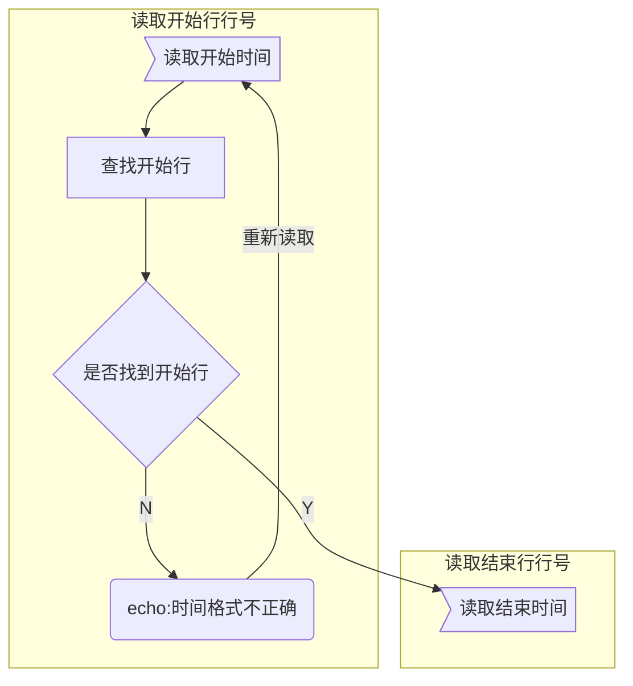

# shell编程练习读取分析secure日志

## 任务描述

设计一个shell程序，从`/var/log/secure`日志文件中按时间提取出`Failed password`和`refused conection`的记录，分别统计这段时间内两种记录的总次数，统计造成这些记录的ip，并统计这些ip造成的`Failed password`和`refused conection`的记录数量和最近的时间

## 任务分析

### 输入：

查询时间段

### 输出：

```
						lastdata	increament	now
total failed times:		100			+10			110
total refused times:	100			+20			120
total ip:				100			+10			110

```


## 流程图

### 按时间读取并转储secure文件到.secure



### 遍历.secure找出Failed和refused记录

```mermaid

```